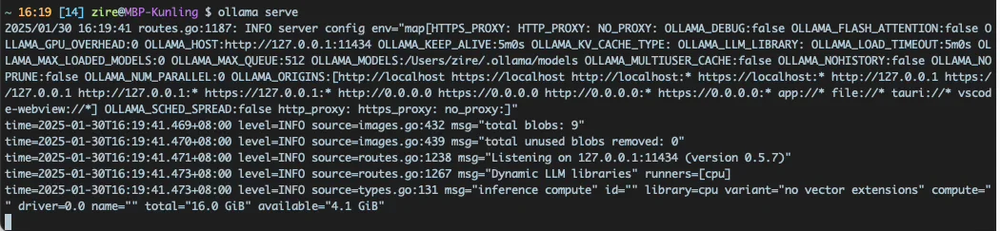
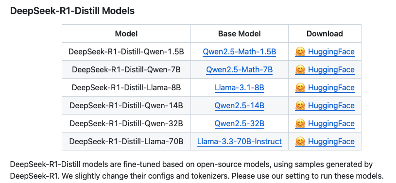
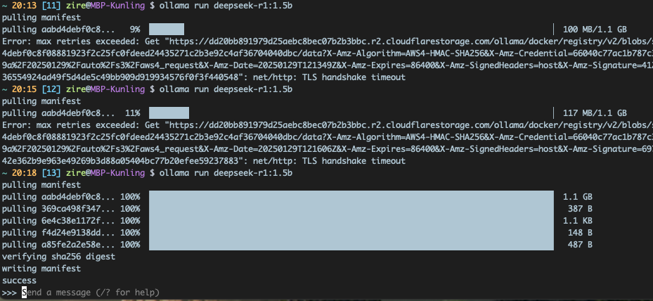
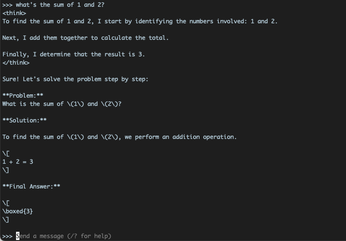

A few days ago Chinese AI startup DeepSeek released its latest R1 large language model (“LLM”) and took the whole world by surprise. It uses only a tiny fraction of the GPU machine cost of its much bigger rivals like chatGPT from OpenAI, but delivers the same or even better result. It’s open source too, so everyone can use its service for free. The world’s most valuable company NVIDIA lost nearly 17% of its market cap overnight, as R1’s superb performance suggested that piling up NVIDIA’s GPU machines to train LLMs with brute force might not the only way to advance AI.

)

Yesterday I managed to deploy DeepSeek on my MacBook Pro. Here’s how I did it. It’s actually quite simple. The advantage of running an LLM on your home computer is that you can use it without relying on the servers of DeepSeek, which are currently humming full speed ahead and frequently can’t connect due to high traffic. Another benefit is that the questions you throw to DeepSeek - the prompts, will not be sent to the server and potentially be exposed to others. Your prompts reveal a lot about who you are and what you do. It’s best to keep them private on your own local machine.

Here’s my MacBook Pro:

* Apple M1 Pro, 14-inch, 2021
* 16 GB memory
* macOS: Sequoia 15.2
* Hard Disk: 1 TB SSD

Open up [iTerm2](https://iterm2.com), which is a feature-rich replacement for Mac’s default Terminal.app, and install [Ollama](https://ollama.com/download/mac) in [Homebrew](https://brew.sh), Mac’s package manager.

```None
$ brew install ollama
```

After installation, check the version.

```None
$ ollama --version
ollama version is 0.5.7a
```

Spin up the Ollama server:

```None
$ ollama serve
```

It looks something like this:

[](./7ba8553c-9f64-42a7-9c9f-999e61346107_1050x243.webp)

You can pick a model that your Mac’s memory and hard disk allow. The bigger the number in front of “B” (for billion of parameters), the more accurate the model is. I’ve downloaded 1.5B, 8B and 14B model.

<https://github.com/deepseek-ai/DeepSeek-R1>

[](https://github.com/deepseek-ai/DeepSeek-R1?tab=readme-ov-file)

Keep this Terminal (iTerm2) window open, open another Terminal window and download DeepSeek R1’s 1.5B model.

```None
$ ollama run deepseek-r1:1.5b
```

If your network is slow, this downloading process may take a few tries, but don’t worry, the download will resume where you left it off. If you have a VPN service that can route your machine through a US IP address, it will speed up the download quite a bit.

)

Once the download/installation is successful, you will see a prompt. Time to fire away your questions! You can now play around with a local copy of DeepSeek, the most advanced AI that resides on your laptop.

)

Type /? to see the prompt menu

)

Two useful prompts:

* /bye to close out this session
* /clear to clear the session context

If you don’t /clear, DeepSeek will treat the dialogue as an ongoing, continuous conversation and sometimes over-think too much.

To restart DeepSeek, just type the same command before, while keeping the Ollama window open.

```None
$ ollama run deepseek-r1:1.5b
```

You can also try out bigger versions of R1.

```None
$ ollama run deepseek-r1:8b
$ ollama run deepseek-r1:14b
```

Experience DeepSeek’s famous “chain-of-thought (COT)” yourself. It’s quite amusing, though the locally run, distilled model is much slower than what you can get straight out of <https://chat.deepseek.com>. This is the price for privacy.

)

To run DeepSeek R1’s undistilled model will [require 768 GB memory and quite a few M4 Mac machines](https://x.com/carrigmat/status/1884244369907278106), which is beyond the reach for most consumers. Running the distilled model is a lot easier and could be done by just anyone. Try it out!
