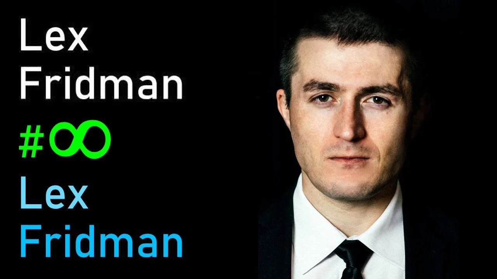
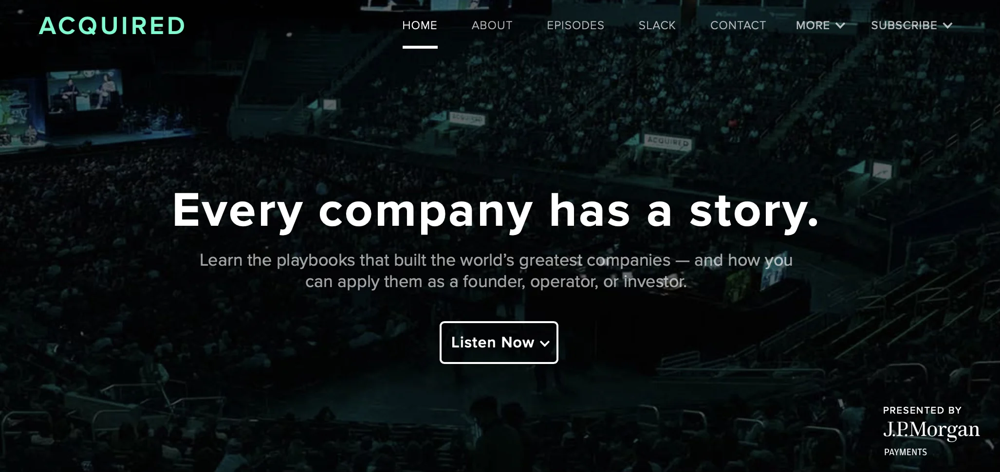
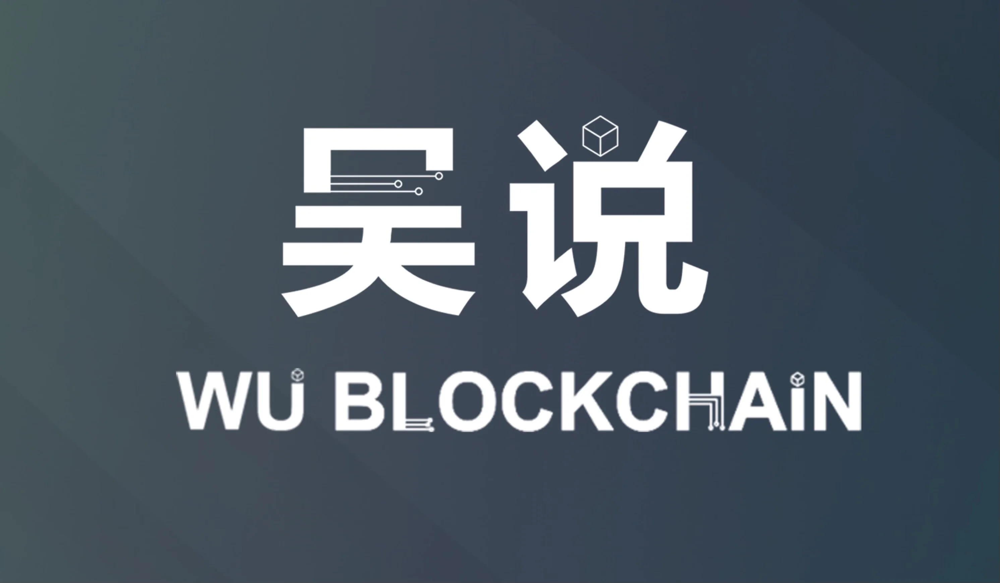
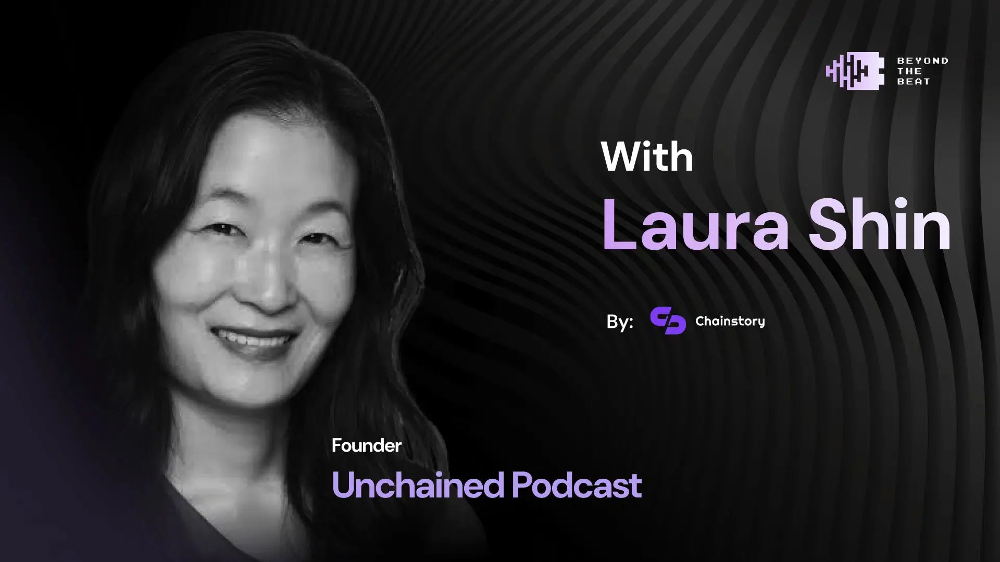

Podcast has become one of my primary sources of information intake, besides Twitter, since more than ten years ago when I lived in Palo Alto, CA. In 2025, podcast is still a very potent channel for information, insight and perspectives of very high density, though its supremacy is being challenged by the rising AI LLMs that can summarize podcast episodes based on transcripts.

Some of them are getting very long - such as the recent DeepSeek episode on **Lex Fridman** that clocked at 5 hours 16 minutes, but still, the good ones are worth listening to. These are the top ones from my library:

## 1. Lex Fridman Podcast

It’s probably the best tech-focused podcast right now, surpassing Tim Ferriss. Fridman books the most sought-after guests in the technology industry and has interviewed every superstar scientist and entrepreneur in AI in the last 12 months. Elon Musk is a frequent guest and his chemistry with Fridman produced many famous moments. Fridman is a research scientist at MIT with strong tech background, so he’s able to ask very penetrating questions that get to the core of the topics. Occasionally he gets carried away (like the episode with Neal Stephenson of Snow Crash) by talking too much of himself, but most of the time he is a graceful and skillful host. One complaint: his ad now takes up almost 8-10 minutes upfront in each episode. It’s just audacious but does demonstrate what a strong brand his show has.

## 2. Acquired

Co-hosts Ben Gilbert and David Rosenthal do a superb job of researching and dissecting the growth stories of successful companies, from TSMC, NVIDIA, Lockheed Martin, to Duolingo. Their episodes are long - usually 3 hours and above, but extremely insightful, easily trumping any business case write-ups from Stanford/Harvard. Sometimes they interview the founders (Morris Chang of TSMC or Zuckerberg of Meta); sometimes they just walk through the history of a company and break down its less well known success formula (like Lockheed Martin). All their episodes are of very high quality and always intellectually stimulating. It’s a gem.

## 3. Techmeme Ride Home

It’s very hard to do a daily podcast show but Techmeme Ride home pulls it off very well. If you need your daily fix of catching up with what’s going on in either traditional tech or Web3, this is the one and only show for you. Other similar shows are either exclusive on Web3/crypto, or are only covering Web2, which are still important but less exciting. Each episode is only 20 minutes - this is PERFECT. Anything longer than that will just create fatigue and not be able to keep its subscribers engaged on a daily basis. I’m a fan of host Brian McCullough’s rapid-fire style. It’s very energetic, just like a grande hazelnut latte in the morning.

## 4. Colin Wu’s Crypto Podcast (吴说不加密播客)

One of the best podcast on cryptocurrency and Web3 is a Chinese one. Surprise! Colin Wu is the founder of [Wu Blockchain](https://x.com/WuBlockchain). With 510K followers, it is the largest crypto news media that targets both English and Chinese markets. Colin conducts Chinese interviews for crypto KOLs, up and coming founders and accomplished investors, or sometimes hosts a round table panel discussion. If you find something getting hot in crypto, usually Colin will be the first one to invite its founders to speak about it. Especially for all the crypto projects that are founded by Chinese, Colin Wu’s show would be the best place to learn about them. Colin is not the smoothest interviewer in the world and his hosting skill can sometimes be jerky and lack of finesse, but he’s very well respected and people love breaking stories on the show.

## 5. Bankless

Hosted by Ryan and David, Bankless is commonly regarded as the No. 1 crypto podcast by many, though I think its glow has faded quite a bit in the last two years. Ryan and David are massive Ethereum fanboys so Bankless serves up everything that’s worth talking about in the world of Ethereum and its sprawling L2s. Vitalik is a frequent guest who sometimes shares his latest philosophical thinking. The show updates very frequently, at least several times a week if not daily. To me its one-hour episode is too long for such a daily show. Unlike Colin Wu, Ryan and David are eloquent speakers but they talk too much - a bit too high on their own supply. Also, Ryan and David don’t come from a technical background. Their apparent lack of technical understanding in many crypto innovations sometimes blindsides them - in 2025 Ethereum is hardly the most innovative or advanced blockchain out there. Its influence has been on a steady decline.

## 6. Unchained

Laura Shin’s Unchained can barely stay on this list in 2025, but it still has a spot. Laura Shin doesn’t have much technical background or in-depth understanding of crypto, but she’s been in this journalism business covering crypto for a long time and her show can still cover some useful corners that other more edgy podcast shows don’t bother to go. Her show is a useful bridge connecting traditional Wall Street and the government to the crypto world. If you have been away from crypto for a while, just come back and want to rebase yourself in crypto, Shin’s Unchained is a slightly boring but reasonable place to start.

## 7. The Tim Ferriss Show

Ten years ago, Ferriss’ show would have easily claimed the top spot on this list, when he was far and away the best podcaster in the world, before Joe Rogan and Lex Fridman caught up to this podcast phenomenon. Ferriss doesn’t cover technology exclusively - his show is about breaking down the success formula of successful people, who come from all walks of life. A masterful marketer and promoter, Ferriss himself has an amazing entrepreneurial journey from unlikely trajectories with an illustrious streak of unusual accomplishments, which enables him to hold court with his famous guest speakers. Sometimes he gets carried away by trying too hard in proving I’m-also-good-on-this and it creates slightly cringy moments. That said, Ferriss’ interview on Silicon Yoda master Naval and crypto legend Nick Szabo are must-listen podcast episodes for everyone in crypto.

## 8. Joe Rogan Experience (JRE Podcast)

Rogan’s career transformation from a small-time comedian to the most coveted podcaster in the world is quite an impressive feat. His show invites celebrities of all kinds, not just technology. Rogan is a natural dinner host - he makes everyone feel like home by being just another everyday dude sitting right next to you at the bar and sipping beer. Unlike Fridman or Terriss who apparently follow a list of topics to cover and visibly work methodically to check them off, Rogan seems to just follow the flow of the conversation and is very comfortable to go anywhere the guest wants. His recent episodes with Marc Andreessen, Brian Greene (“The Elegant Universe”), and Elon Musk are highly recommended.

## 9. Orange Book (橙皮书)

Here’s another Chinese podcast that has been able to hold on to high standard, though for smaller audience with more niche topics. Leon Li is a well respected KOL in the Chinese crypto circle. His show doesn’t chase the hottest trends in the industry but talks about interesting subjects and ideas are usually more early-stage before becoming public knowledge. It’s a good complement to other podcasts that cover the basics but don’t go into the frontier enough.

## 10. Future of Life Institute Podcast

FLI (Future of Life) is a non-profit organization whose mission is to “steering transformative technology towards benefiting life and away from extreme large-scale risks”. It hosts many talks with researchers, policy experts, scientists, philosophers and influential thinkers. The conversations are much less commercial (“let me introduce you this great new DeFi protocol”) and much more forward-looking. They are concerned about the arrival of AGI, superintelligence, possible extinction of civilization, autonomous weapons, nuclear wars, quantum computing, etc. It helps to occasionally revisit the doomsday scenario and re-measure how far away we are from that.

---

These are the top 10 tech podcasts I (still) listen to in 2025. Frankly speaking, there is not enough time to consume them so we have to be brutally selective. If you come across another high-quality podcast not on this list, feel free to share that with the community by dropping it in the comment below. Thank you!

Digital Sovereignty Chronicle is a reader-supported publication. To receive new posts and support my work, consider becoming a free or paid subscriber.
