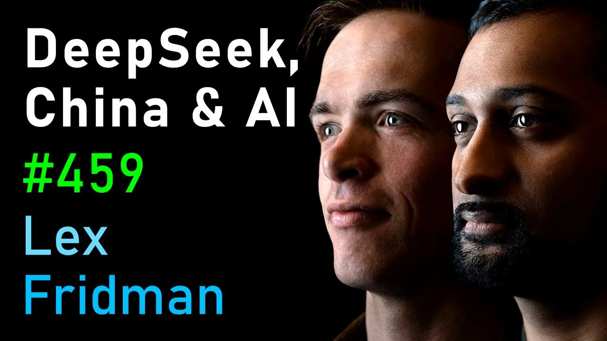

This 5-hour interview must be the longest podcast episode I’ve listened to, but it’s still worth it. Below are my notes. They’re not meant to be a verbatim summary to capture every word they uttered. I only took what I found useful. You can find the full transcript [here](https://lexfridman.com/deepseek-dylan-patel-nathan-lambert-transcript).

WARNING: the first 13:15 are all ads! Fridman must be paid quite well to do this.

## DeepSeek & LLM Battle

* Open Source vs Open Weights

  * Open Source requires full transparency, including training data, code and parameters, such as
  * Open Weights focuses narrowly on releasing model parameters, not necessarily extending to training methodologies or datasets.
  * DeepSeek R1 is both open weights and open source
  * Meta’s Llama is only open weights in practice
* Llama 3’s technical paper is less actionable than DeepSeek’s R1
* DeepSeek’s MIT license is a lot more permissive (the most friendly license of all) than Llama’s quirky license (which unilaterally imposes many restrictions that actually go against the spirit of open source)
* Open weights allows users to deploy LLM locally without relying on server-based APIs
* Why DeepSeek can do this training at such low cost ($5M-ish)?

  * MoE (Mixture of Experts) and MLA (Multihead Latent Attention)
* Llama is a dense model (based on transformer architecture). All the parameters are activated and used.
* MoE only uses some relevant parameters when solving a question, similar to the human brain. The model will learn how to route through different expert nodes for each task, thus creating more space to store parameters. Only 37 billion parameters need to be computed each time for DeepSeek R1.
* DeepSeek uses PTX, a low-level language to schedule communication directly with chips, circumventing Nvidia’s CUDA library
* Nvidia’s CUDA is a standard general model that works with any LLM, but sacrificing performance
* DeepSeek’s ratio of MoE is 32 experts - extremely high. Such high sparsity requires very efficient orchestration of the neuron network to avoid overloading a single expert with all the tokens while the other 31 sitting idly.
* Bitter lesson learned from DeepSeek R1’s runaway success over other LLMs:

  * Getting all the human barriers out of way and let machine learn
* AI Labs are like the chip makers or drug makers. Training LLM involves many failed runs, costing huge time and money, until an optimal one is found.
* Why it’s natural for a quant fund to go into AI research?

  * Need NLP (Natural Language Processing) to understand a press release
* Fridman must be dying to invite Liang Wenfeng to his podcast, as he just hired a Chinese translator
* DeepSeek only publicly claimed to use 2K GPUs to do pre-training for V3, and shared no cost data for other research efforts or shared cost with the parent hedge fund. SemiAnalysis estimates DeepSeek has close to 50K GPUs.

## **Export Control & Race on AI Chips**

* Export control won’t work well for China. There are always ways to circumvent.
* Fridman, Lambert and Dylan are thinking 2030 to be the arrival moment of AGI
* OpenAI’s Stargate project of building data centers, once completed, provides 2 Gigawatt power. This is rather ordinary and nothing special compared to what China’s superior industrial capability can build, if there is no supply constraint.
* Hypothetically, how to cause the most economic damage to the world?

  * Hitting the R&D centers of TSMC
* Some goals (80% made in China) in *Made in China 2025* have been achieved but not the semi-conductor industry
* More choppy waters ahead in a dual-hegemony world
* Three most important aspects of an AI chip:

  * Chip-to-chip interconnection
  * Floating point operations (flops)
  * Memory bandwidth (I/O）
* H20 (shipped 1M to China last year) looks like a castrated version of H100 (not allowed to be exported to China), but it is actually better in certain tasks, which is reasoning. It cuts down flops, but it’s on par on interconnection and even better on memory bandwidth vs H100.
* pre-training is all about flops
* In the past, US government only cares about flops in its export control, though the other two axises are just equally important
* Output tokens are more expensive than input tokens, because input tokens can be processed in batches but output tokens can’t. Output tokens compute is a non-parallel operation.
* Memory is becoming super important. Reasoning and AI agents in the last few months led to much higher need for memory. Output sequence has to reside in the memory, which means fewer users can be served at the same time.
* All the mid-to-large companies are racing to serve DeepSeek APIs, but their throughputs in real tests are all very low
* DeepSeek’s attention (MLA) is a different kind of attention from the attention from the *All You Need Is Attention* paper
* OpenAI makes a very fat margin on inference but that’s not enough to recoup their costs on training
* Open source is going to be the mainstream. DeepSeek has leveled the play field and set a high standard.
* British English is dead because LLMs are all trained in American English (by a few tech companies in San Francisco).
* Superhuman persuasion will happen before superhuman intelligence - Sam Altman
* The more I’m using the internet, the more I feel others are controlling my mind - Lex Fridman
* How to get the right alignment in LLM, to preserve facts as they are?

  * It’s extremely hard to get it right. If an LLM takes a wrong input in pre-training, it would take a huge effort to scrub it out.
* System prompt can overwrite user prompt in the back scene. Google’s Gemini made an execution error to introduce diversity prompt in its infamous *Black Nazi* fiasco.
* Two learning methods:

  * 1. Imitation learning (pre-training, supervise training, fine tuning)
  * 2. Trial and error (reinforcement learning)
  * 2 is a lot more powerful than 1
  * All the magic comes from 2
* Singapore is about 20% of Nvidia’s revenue
* Diffusion rule imposed by the US government will have a real impact on Chinese AI companies. Even though its LLM is good, DeepSeek doesn’t have enough GPUs to serve them to its users.
* Reddit is still very influential as its subreddits are being scraped by all the LLMs
* Many AI startups train on OpenAI’s data to bootstrap themselves in the beginning
* Japan is a good place to do AI:

  * 9 Gigawatt of curtailed nuclear power
  * Has a law that allows training data from the internet with no limit
  * Diffusion rule has no restriction in Japan. Japan can do whatever.

## Data Centers & Stargate

* 15-20 Megawatt is a typical size for data center
* For optimal long-term planning, nuclear power plant, which has the highest energy efficiency ratio, should be right next to a data center
* In the short term, it’s easier to build data center next to hydropower station
* Gigawatt data plant is a thing now. All the T1 tech giants are racing hard.
* AI training needs GPUs to be collated in one single cluster (data center) for optimum speed (instead of routing through remote sites). That’s why these data centers are getting bigger and bigger.
* No strong competitor to Nvidia now. AMD has good hardware but its software is bad.
* Any business that is based on GPT-3 or 4 is dead
* Hardware is the only place to make money now on AI
* Wrappers like Perplexity can also make money
* Softbank doesn’t have that much money right now (Musk is right). Sun has to sell off Softbank’s stake in ARM first to release more cash for investing in OpenAI.
* Can’t explain Stargate’s $500 Billion number. $100 Billion is reasonable and can be justified.
* US government doesn’t put money into the $500 Billion deal. Its role is to allow this deal to happen (without the anti-trust hammer).

Digital Sovereignty Chronicle is a reader-supported publication. To receive new posts and support my work, consider becoming a free or paid subscriber.
