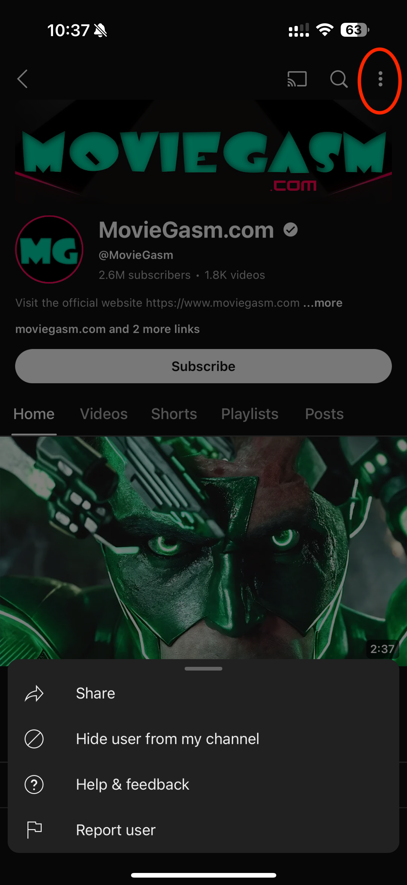

The rise of the AI age brings about an unpleasant side effect (among many others), that is, fake movie trailers.

One of my guilty pleasures is to watch trailers of upcoming movies. In the past this was easy, IMDB had everything. For a while apple.com used to host high-quality trailers for major films. Eventually they’re all on Youtube.

Unfortunately, there is now a proliferation of fake movies trailers on Youtube thanks to AI technology that enables anyone to create a concept art in the style of Wes Anderson easily. The increasing presence of these fake movie trailers on my Youtube feed significantly spoils the fun for me. I need to block those channels.

This is harder than I think. On my Safari window, I go to one such channel and click the three dot “more”.

)

In the pop-up window, there is only “Share channel” or “Report user” option. There is NO option for me to block this channel/user. On Reddit, people say clicking the three dot thing would lead to an option to block the channel, but I don’t see that.

)

After a bit of tinkering, I found the solution - use the phone. In the Youtube app on my iPhone, find the foul-playing channel and click the three dot menu on the top-right corner. A pop-up menu from the bottom displays an option to block this user from my channel. There you are!

)

Click on “Hide user from my channel” and confirm on the next window

)

The Youtube app will display a quick alert message in the bottom. Congratulations! You’ve successfully blocked this channel from appearing on your feed.

)

Youtube, you deserve a medal for hiding this feature so well in such an unsuspicious corner. You really go out of your way to ensure you can bombard my feed however you want.

Digital Sovereignty Chronicle is a reader-supported publication. To receive new posts and support my work, consider becoming a free or paid subscriber.
