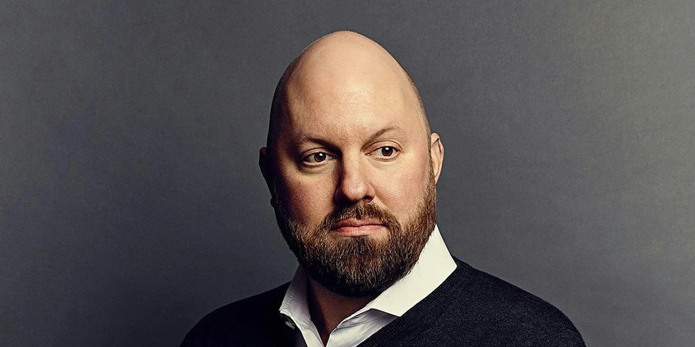

Marc Andreessen has been on a roll lately, from Joe Rogan to Lex Fridman to Patrick O'Shaughnessy. This episode on Fridman recorded on January 27 is the longest one, clocking at 5h:16m. It talks about America’s new spirit, Wokeness, “thought criminals”, DEI, problems at universities, affirmative action, and AI. Andreessen is very bullish on America’s future. I took down some notes that I found useful and insightful. The original, full transcript can be found [here](https://lexfridman.com/marc-andreessen-2-transcript).

## Outlook for America

* The best time for America is the **Roaring Twenties** and that will probably return in the next few years. US' economy is very resilient because:

  * It has a blessed geography that provides national security and abundant resources
  * US can be energy independent anytime it wants
  * It has the most most dynamic and progressive people
  * It is still the most advanced technology leader (though manufacturing is an issue)
  * All US' competitors are struggling with profound issues. US has a very strong competitive position.
* The last 10 years is like the miserable 70s that was filled with bleak and disheartening news. **President Regan** then came along and saved US. Marc's alluded to suggesting **President Trump** might do the same.

## Does Civilization Progress?

* French historian **Numa Denis Fustel de Coulanges** was a walking encyclopedia of Roman and Greek culture. He wrote a book, **[The Ancient City](https://en.wikipedia.org/wiki/The_Ancient_City)**, in 1864.

  * He reconstructed the society before greeks and romans, which was Indo-Europeans
  * No technology and everything was about survival
  * Social order followed, family, tribe, and city
  * Zero concept of individual rights
  * Anything that was strong was good. Anything that was weak means death.
  * Maximum fascism combined with maximum communism
  * No market economy and everything was shared
* Conversational wisdom says that we get better each year and civilization always progresses ahead. Indo-European ancestors would beg to differ and say:

> Oh no, you people have fallen into shit! Your civilization has been regressing, not progressing. You're not doing better than we are!

* Identity politics is worshipping ancestors

## Wokeness in US

* Many parts of US, from Silicon Valley to Hollywood, felt reinvigorated after Sep 6. Some people are still anti-Trump, but there is a strong sense of optimism that suggests the miserable last ten years is behind us, Wokeness is over and many impactful projects that have been on-hold will now reboot.
* **Larry Fink**, CEO of **Blackrock** used to be the first one to embrace all the stupid ideological initiatives of the left (such as ESG). He’s been back-paddling on many of those in the last 12 months.
* **NASDAQ** imposed diversity requirements for the board of listed companies. So ironically **Peter Thiel** became a diversity hire in one of the boards he and Marc sat on. That was very offensive to Peter.
* There is a further board requirement for LGBT. The "B" part is especially hard to meet. Marc is like:

> I love this company, but not so much to go *THAT* far.
>
> And by the way, is there a test for “B”?

## Secret Dance of Thought Criminals

* Most people are conformists. At an event, you run into someone and have a chat. You feel you get along with him, share the same social-political view, and try to venture further. You crack a joke. If he doesn’t laugh, you slowly back away from the awkward moment. If he laughs, you just establish a secret handshake with another thought criminal.
* **Joke** is how you find out other thought criminals:

  * You have deniability
  * Laughing is voluntary. You can’t fake that.
* Then you think about if you want to bring the third thought criminal new friend to a dinner party of 6-8 people. You do a lot of dancing, essentially vetting, to make sure it’s safe for everyone.
* Finally you go to the dinner party and have the best time of your life. No more bullshit and finally you can say the real things with like-minded people. At such party, jokes are traded around and constantly testing the boundary. Sometimes a joke goes too far and someone becomes uncomfortable and people go, this is too soon, maybe we come back to this next year.
* That’s the current America

## Private Truth and Public Life

* **Twitter** and **Substack** are two great tools to ensure freedom of speech
* The message disappearing feature on **Whatsapp** and **Signal** are also instrumental
* **Private Truth and Public Life** is the best book on this subject

  * The consequence of public lying is that you no longer have a gauge how many people agree with you
  * If only 10% agree with you, you get killed; if 90% agree with you, you win the revolution. So this percentage is really important.
  * What happened in the last 2 years came straight out of this book - **Elon Musk** stood up and caught their bullshit
* Two other great books, **The Power of Powerless**, and **The True Believers**, which talks about how elites align their beliefs with the mass.
* Marc thinks **Elon Musk** is 100% consistent between what he says publicly and privately. The other two guys are **Trump** and **Zuckerberg**.
* Marc's view on the distribution of social beliefs in US:

  * 20% are true believers (Ford Foundation, Washington Post, New York Times)
  * 60% are the mass
  * 20% are counter-elite
  * In the last ten years the middle 60% went with woke. Now they’re pivoting in real time.
* There is a civil war now within the Democratic Party

  * One side is saying we should be less radical and go back to the middle
  * The other side is saying we’re weak and not standing up to our principles. We need to go even more hard-core.
* Marc beat on this **Harvard** professor, a friend of Fridman, who dared not come on to the his podcast because its past guest list already includes Trump.

  * His tenure at Harvard is supposed to provide him with academic freedom and privilege of saying whatever he wants but that is gone. The system is completely rotten.
  * The current university is a cartel system and is fundamentally broke. The only way to progress is wait for some of these universities to go bankrupt, just like corporations.
  * Culture change cannot succeed from within (for example, GE). The only way to engineer change is to start something new that replaces the old one.

## Unchecked Power of Media & Government

* Practically it’s impossible to start an internet business with zero censorship
* Democratic Party turned **hate speech** and **misinformation** into weapons of mass censorship (Twitter leaked files and another similar case with Meta)
* Three things happened that broke through this censorship blockade:

  * **Substack** was carrying the flag for free speech despite of being under intense pressure
  * **Elon Musk**'s buying and revamping of **Twitter**
  * **Meta**
* **Jon Steward** spoke out courageously on the truth of **Covid** on **Stephen Colbert** show. That was the first time somebody blew this up on mainstream media.
* The common experience of every past and present **Twitter** CEO is daily beatings
* CEO is a very lonely job. He can’t talk to anyone about his issues.
* It’s impossible for a company to fight with the government
* The government decided that the first amendment didn't apply to them
* **Stanford Internet Observatory** is outright illegal
* How does government exert power?

  * Legislation
  * Regulation
  * Administration
* The third one, administration power, is often most powerful and hurtful
* **Facebook**'s crypto project **Libra** was torpedoed by a threat letter from two senators to all the banks

  * It was neither a legislation nor a regulation, but enough to scare away all the potential customers of Libra
* Censorship machine is like the ring of power from **The Lord of the Rings**. It’s infinitely tempting and will corrupt anyone, like it does for Gulu.
* Money doesn’t necessarily win political battles. Hilary outspent Trump 3:1 in 2016 and still lost.
* Many institutions attempted to experiment different types of democracy. **California**’s proposition system is one example but is a complete failure.
* A columnist of **NYT** can get a CEO fired, but not the other way around
* A key question **Machiavelli** would ask: who has the ultimate power?
* Marc mentioned the the intriguing turmoil of **LA Times**, where its reporters seemed to be more powerful than its owner
* Both praised **Bill Ackman** for his crusade on the establishment education institutions

  * He’s using skills from activism PE play (exert control of the company and effect changes with only minority stake) in a new area
* The new administration staff is a gigantic upgrade to the previous regime

  * It's pound for pound the best since Eisenhower, such as new head of **NIH**, **FDA** and **CDC**.
* What makes this effort of unwinding government regulation and spending different from previous attempts by Gore and Regan?

  * Social media
  * US is adding $1 trillion debt every 100 days
  * The level of contempt for taxpayers is off the chart

## Immigration, Affirmative Action & DEI

* Marc used to be a strong supporter for **H1B**, but there are nuances to this issue than meets the eye
* There is no flow of talent from small town (like the one where Marc grew up in Wisconsin) in America to Silicon Valley or big cities. Why?

  * **Affirmative Action**
* The unprecedented 2023 case of **Harvard vs UNC** that revealed the inner workings of Harvard admission office and how **racist** it is:

  * Asians need to score 400 points higher on SAT to get admitted
  * A running joke in Silicon Valley's medical community - if you want to hire a super genius, hire an Asian student from Harvard because he’s guaranteed to be an Einstein.
  * Asians and Jews have been systematically excluded from the establishment system
  * Harvard was struggling to recruit American-born black students, so they recruited blacks from Nigeria or Northern African countries (where **Colin Powell** and **Kamala Harris** came from), which accounted for 50% of the blacks admitted.
  * This totally defeats the purpose of affirmative action, which is supposed to compensate for the injustice to the slave ancestors of the current black population in America. Blacks imported from other countries are NOT entitled to affirmative action.
  * All the DEI programs bear the same characteristics in this 2023 Harvard case. This prevalent practice has been going on for decades.
* H1B issue needs to be reviewed together with DEI

## America's Education System

* The biggest evil thing the Western civilization has done is **colonization** and **resource extraction** (Avatar 2009), but somehow the west is at peace with brain-drain of human capital from other countries. Marc is contemplating whether this is justified or just the same evil.
* What happens if US is getting stronger and other countries are faltering? US needs other countries to succeed.
* Silicon Valley no longer relies on H1B visa, but **O-1 visa** - the super genius visa, to recruit real talents.
* For companies like Amazon that has unlimited resources, they can launch long term program to groom American-born talents, but they still choose to hire foreign talents via H1B
* Do you want to flame the issue or diffuse the issue?

  * Diffuse the issue
* National Merit Scholarship looks for 0.5% brightest kids in the country but not a single university is using that to scout for talents, and they all have full-time scout teams for basketball players.
* SAT is an IQ test but it has been dumb-ed down in the last ten years and become more coachable, which benefits Asian families
* There are too many kids that can score 800 now. 800 is no longer an accurate indicator for intelligence. It doesn’t identify genius any more.

## What's Next for AI

* Companies fall into two forms:

  * Weak form: adding AI as the 6th bullet point on top of what it already does
  * Strong form: using AI to redo everything (Cursor)
* A new breed of companies would:

  * Have redesigned org chart powered by AI
  * Human manages a fleet of AI agents, or
  * AI manages human (AI is actually better at process-driven management)
  * Be entirely run by AI
* Many large companies are unable to innovate NOT because they’re badly run, but because they’re very well run in serving their existing customers. That’s why there are always opportunities for startups who come from nowhere with nothing.
* Several trillion-dollar questions for AI:

  * Large models vs small models
  * Open models vs close models
  * Whether to use synthetic data or not
  * How far can you push Chain-of-Thought and Reinforcement-Learning?
* 3 battles that are waged by government

  * Social media censorship
  * Debanking
  * War on crypto industry
* The 4th battle may happen to AI where political regime tries to restrict AI tech
* **Substack** has become home to many high-quality thoughtful contents
* Crypto provides the ideal economy for a future world filled with AI agents
* The three “Godfathers of AI”

  * Yann LeCun is a strong critic for LLMs and thinks it’s an evolution dead-end
  * Yoshua Bengio and Geoffrey Hinton are extreme radicals
  * It’s good to have LeCun to counter the other two
* What’s Marc’s definition of success?

> Making contribution to the society

## Fun Bits

* Marc’s 9-year old son watches South Park and plays coding challenge
* The 2008 film **Tropic Thunder** is legendary

---

Here’s the original podcast video, enjoy!

---

Digital Sovereignty Chronicle is a reader-supported publication. To receive new posts and support my work, consider becoming a free or paid subscriber.
