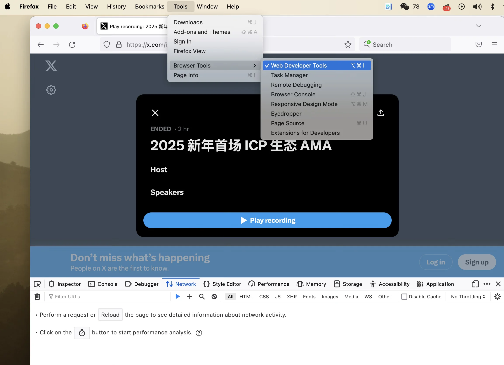
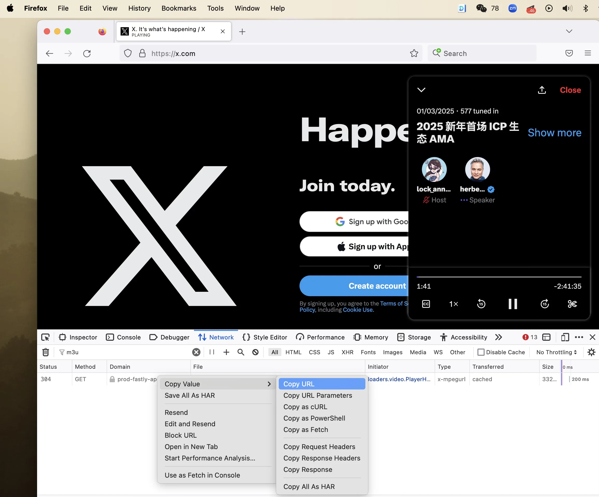
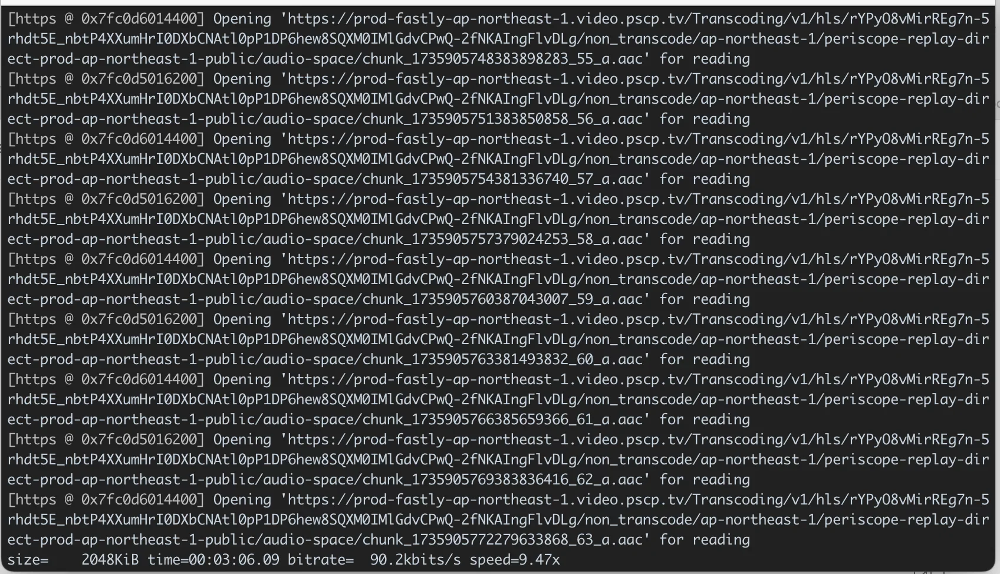
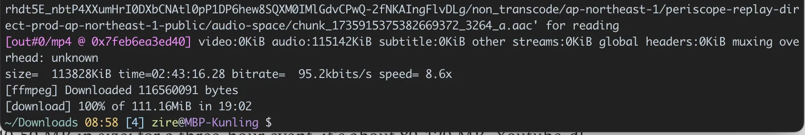

Since its launch to the general public in May 2021, which as-a-matter-of-factly crushed one-hit wonder Clubhouse, **Twitter Spaces** has become a very popular tool for KOLs and communities to host panel discussions, town fall meetings, AMA (Ask-Me-Anything), or even public debates. The top spaces often draw millions of listeners.

However, Twitter doesn’t allow easy download of the audio files from those spaces. Only the original host of the space can download audio file and that process is painfully slow, manual and arcane. I frequently join Twitter Spaces to moderate panel discussions or speak on all things ICP and Web3. It would be cool to have access to my own public talk records even when most of the time my Twitter account is not the host of those events.

I have tried many methods over the last three years to download the audio files from Twitter Spaces. Some websites offer solutions for a fee, but I don’t want to rely on them. In the world of free DIY hacks, many methods usually worked for a while, then failed after a few months as Twitter revised its API in a constantly evolving game of cat and mouse. The current one[1](#footnote-1) seems to be quite resilient. Here’s how it works:

## 1. Download youtube-dl

Download the open-source, command-line tool **[youtube-dl](https://ytdl-org.github.io/youtube-dl/index.html)** from its official site:

> <https://ytdl-org.github.io/youtube-dl/index.html>

Since I’m on a mac, I use:

```None
$ brew install youtube-dl
```

Check the version:

```None
$ youtube-dl --version
2021.12.17
```

## 2. Find Twitter Spaces URL

[](./2d65d514-99f7-4045-880e-b4b48bd0f351_2306x1670.webp)

Open Firefox[2](#footnote-2) browser. Go to **Tools/Browser Tools/** and open “**Web Developer Tools**”

Go to the Twitter Spaces’ URL, for example,

<https://x.com/i/spaces/1MnGnDkaZQYxO/peek>

In the developer console that opens up at the bottom of the window, go to “**Network**” tab and play the Twitter Spaces.

[](./b5fc2c63-0d02-47c7-914b-5f49ea6db890_2310x1918.webp)

Type “**m3u**” in the filter field in the console. The console will filter out all other assets and display only the m3u list file. Copy its URL. It’s a very long URL and that’s normal.

## 3. Download MP3 File

In a Terminal window, go to the directory where you want to save the file to and run:

```None
$ youtube-dl “space-url”
```

Or in this case:

```None
$ youtube-dl “https://prod-fastly-ap-northeast-1.video.pscp.tv/Transcoding/v1/hls/rYPyO8vMirREg7n-5rhdt5E_nbtP4XXumHrI0DXbCNAtl0pP1DP6hew8SQXM0IMlGdvCPwQ-2fNKAIngFlvDLg/non_transcode/ap-northeast-1/periscope-replay-direct-prod-ap-northeast-1-public/audio-space/playlist_16710828688056387844.m3u8?type=replay”
```

[](./3265dc95-7006-4cb0-be77-6e9dee70b7f4_1696x974.webp)

This would try to download an **mp4** video file. For a one-hour Spaces event, the mp4 is about 40-50 MB in size; for a three-hour event, it’s about 80-120 MB. Youtube-dl breaks up the destination file into many smaller chunks and downloads them one by one. This process is slower than a typical straight download from website and could take 10-30 minutes. It’s pretty steady though.

[](./c3c7fd51-dbba-4eb9-a57e-0670a4d832dc_1688x284.webp)

## 4. Convert Video into Audio

The mp4 file is called:

> playlist\_16710828688056387844-playlist\_16710828688056387844.mp4

You can further convert this video file into an audio one with another command-line tool, the ultra versatile Swiss knife **[FFmpeg](https://www.ffmpeg.org)** that can handle any media file at ease.

```None
$ ffmpeg -i "your-video-name.mp4" -vn -acodec copy your-audio-file-name.aac
```

Run this in Terminal,

```None
$ ffmpeg -i "playlist_16710828688056387844-playlist_16710828688056387844.mp4" -vn -acodec copy your-audio-file-name.aac
```

[](./ff920079-04b0-4ac4-b3e4-3ee541cd6904_2252x1538.webp)

This will result in an **.aac** audio file, which is slightly smaller than its original video container form.

Now you can save the video/audio file in your own depository and share that on social platforms such as Substack or Youtube, forever.

---

As of March 2025, you can just run this command to start the download:

```None
$ yt-dlp twitter-spaces-url
```

---

If you enjoy this post from Digital Sovereignty Chronicle, please type your email below and subscribe to the newsletter, where I share my learning and journey in tech every few days

[1](#footnote-anchor-1)

<https://fnordig.de/til/Twitter/export-twitter-spaces.html>

[2](#footnote-anchor-2)

You can probably also do that on Chrome or Safari browser, if you know where to locate the network asset
