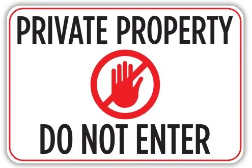
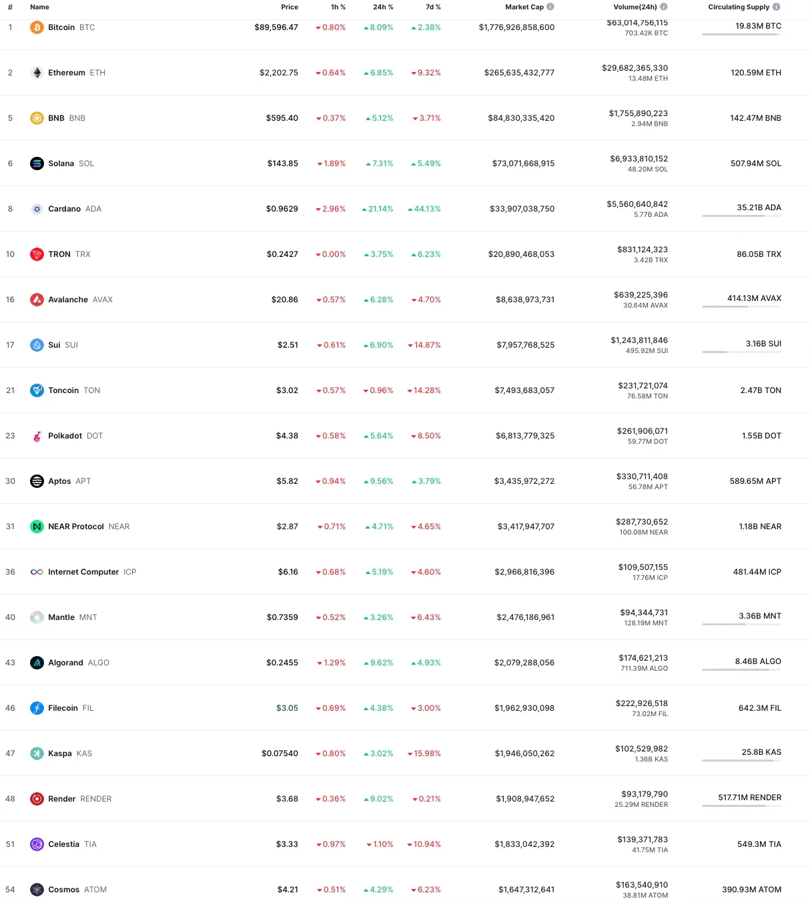

## Background

Crypto has grown into a $3 trillion industry with thousands of blockchains, tens of thousands of dApps, and millions of tokens. For anyone interested in this industry, it would be helpful to first understand who are the different players and stakeholders in crypto, what they do, what are their motivations, and how they interact with each other.

I'm starting a series called "***Decoding the Crypto Ecosystem***" with 12 episodes. Each episode covers a major ecosystem player/stakeholder. They are:

1/ Blockchains; 2/ Miners or Nodes Operators; 3/ dApp Developers；4/ Exchanges; 5/ Market Makers; 6/ Investors; 7/ Infra Tooling; 8/ Communities; 9/ KOLs; 10/ Media; 11/ Traders; 12/ Users

I plan to publish them in the next few weeks. If you know someone who is interested in web3/crypto, please forward this post to him/her and encourage him to subscribe to this newsletter ***[Digital Sovereign Chronicle](https://digitalsovereignty.herbertyang.xyz)*** where I distill complex web3 concepts into simple explanations for friends and family who are not familiar with crypto.

## Introduction

Blockchain is the infrastructure layer of crypto. Without blockchain, there would be no crypto. Blockchain is where all the Web3 applications reside ON. Major blockchains such as Bitcoin are similar to the big tech firms of Apple, Amazon, Microsoft, Google, Meta, and Alibaba for classic web services - they carry the entire industry and dominate the airwave.

But they play a critical role in crypto that's even more influential than what the Magnificent Seven does for traditional industries. A unicorn startup theoretically can still exist without using any service from big tech firms, but any dApp (decentralized application) in crypto, by definition, has lineage deeply rooted in one of the major blockchains.

Imagine the crypto industry is a vast Amazon jungle. There are several extremely large and tall banyan trees that lord over all the animals and plants in the jungle even from afar. These trees continuously grow and evolve every minute, even branching out into smaller trees. They absorb the lion's share of the sun and the rainfall in the jungle. They become bigger and taller ("longer") as time goes by. Each of these gigantic banyan trees is an ecosystem of its own.

Many plants thrive under the banyan tree and even become symbiosis with it. Most of them won't survive without the cozy shadow of the banyan or its protection from gusty winds. These smaller plants grow into bigger plants, attract bees and other animals, and further fuel the growth of the banyan.

These big banyans are blockchains. There are a few thousand of them in Amazon but only the top 20 matters. A blockchain without sufficient critical mass (measured by market cap and funding) does not have enough resources to attract developers to adopt its technology. The largest banyan is ***Bitcoin***, followed by ***Ethereum***. They all have tokens listed on crypto exchanges and have considerable cash reserves that could last through several bull-bear cycles.

## What do blockchains do?

The developer studios behind many large blockchains are non-profit foundations, as explained in [Why Non-Profit in Crypto](https://digitalsovereignty.herbertyang.xyz/p/why-non-profit-in-crypto). They primarily do two things, develop a blockchain and drive its adoption. A typical L1 foundation usually employs a team of 100 ~ 500 full-time employees. The majority would be in R&D to create new protocol features following the blockchain's public roadmap.

Most blockchains' technology is open source. Foundations engage in a variety of activities to recruit developers to build their dApps on their chains, such as publishing bounties, hosting hackathons, organizing hacker houses, conducting workshops, sponsoring industry events, giving out developer grants, etc.

> ***Most of the crypto industry's alpha, in terms of technology innovations and breakthroughs, is created at the blockchain level.***

## Blockchains vs dApps

When a crypto developer uses the smart contract from a blockchain or issues a token for his dApp following this blockchain's token standard, this dApp is considered to have become part of this blockchain's ecosystem. The dDapp may now be featured as an ecosystem showcase on the foundation's website and its TVL (Total Value Locked) will be added to the total TVL of this blockchain.

Developers and blockchains need each other to survive. Each blockchain ONLY promotes startups in its ecosystem (a NIKE shop does not sell Adidas sneakers). Without the technical guidance and GTM (go-to-market) resources from the foundation, a dApp project will hardly go very far.

On the other hand, a blockchain ecosystem without a growing developer base and buzzy developer activities is just a zombie chain. Most of the leading blockchain ecosystems claim to have dDapp projects in terms of hundreds or thousands.

## Blockchain vs blockchain

As blockchains try to grow their ecosystems, they compete with each other for developers to build dApps, for investors to inject liquidity, for media coverage to drive mindshare, and for users to buy their tokens. It's quite rare for them to collaborate. Unlike traditional industries such as airlines or real estate where players can join hands to conquer a higher mountain together, in crypto your loss is my gain.

Most of the large blockchains claim to have full-suite product lines, from DID/wallet, explorer/scanner, DEX, NFT marketplace, node operators, developer grants, community ambassadors, etc. They could easily fall into a deep narcissism complex and get high in their own echo chambers, at the same time displaying an astounding level of ignorance of their competitors' true capabilities. It's hard to walk out of that bubble.

## Protocol vs application

A major challenge for a blockchain is to figure out where to draw a line between protocol-level development and application-level development. Many people believe a blockchain should only focus on developing (open source) standards and protocols and should never veer into the application domain. The creation of dDapps should be left to the developers in the community, not the foundation.

If a blockchain foundation starts developing applications, it will compete directly with its developers from the same ecosystem. The community will cry foul play and lose motivation to push the boundaries for this ecosystem.

But sometimes the foundation feels it has to do this because no one from the community could step up to the plate. So this is a tricky, constantly evolving balancing act that has no simple black-and-white answer.

## Public vs consortium

Broadly speaking, blockchains fall into two types, public chains and consortium (or private) chains. A public chain allows anyone to access and participate in the network, while a consortium/private chain is a permissioned network where only pre-approved entities can access and validate transactions.

Consortium chains are usually not regarded as real blockchains in the daily conversation of crypto people. In certain countries with crypto restrictions such as China, consortium chains may be the only game in town.

## L1 vs L2

Most blockchains are just layer 1 (L1), except for Bitcoin and Ethereum. Layer 1 means the chain has just one layer and that's where the dApps will be built on.

Ethereum has a lot of scaling performance challenges. It's too slow and too expensive, thus creating room for a plethora of layer 2 (L2) chains, which are built on top of Ethereum (L1), acting as a middle layer between the dApps and Ethereum mainnet.

These L2s are also called "rollups" as they process batches of transactions off-chain and then submit a single, compressed transaction to Ethereum L1, to reduce network congestion and transaction fees. Some Ethereum L2s have become quite big, even surpassing some other L1s.

Bitcoin now also has hundreds of L2s that try to enhance Bitcoin L1's scalability and transaction efficiency. While ETH L1 depends on many L2s to roll up the transactions, the same relationship doesn't quite manifest between BTC L2s and BTC L1. All these BTC L2s need to get transactions from BTC L1 to justify their reason for existence, but BTC L1 doesn't necessarily rely on any particular so-called L2 to operate.

## New vs old

Many new L1s are emerging every month. They burst into the scene with a lot of fanfare, record-breaking fund-raising urban legends, and sexy new narratives with no shortage of KOLs singing the praise.

While it's always hard to judge what is real versus just the hype in the world of L1 chains, longevity is still important in crypto. A chain that has been running for a long time tends to be much more secure and resilient to attacks. A blockchain that just released a white paper or is yet to launch its mainnet does not provide anything that can be used to verify its claims. So their claims should be reviewed with a grain of salt.

The most stupid mistake people can make is to compare a new chain not yet in production to an old chain that was already launched a few years ago. It would be prudent to wait for the new chain to run for at least 12 months AFTER launching its mainnet before making any hasty comparison and proclaiming this is the next Ethereum killer.

## Top 20 chains

[CoinMarketCap](https://coinmarketcap.com) is the Bloomberg for crypto. It has all the tokens listed by their market cap. As of March 05, 2025, the 20th largest blockchain is Cosmos ($ATOM) with a market cap of $1.6 billion. This list does not include stable coins (USDT/USDC), animal/meme coins (Doge, Trump), L2s (POL), dApp coins (Uniswap, DAI, BGB), non-L1 infrastructure coins (Chainlink) or blockchains that have long become dormant (Hedera, Stellar, Litecoin, Monero, etc).

These are the essential ones to watch. Other blockchains are too small to matter.

This series will continue in the next episode on miners and node operators. Stay tuned.

---

Next from **Decoding the Crypto Ecosystem Series,**

[EP02: Decoding the Crypto Ecosystem - EP02 - Miners](https://digitalsovereignty.herbertyang.xyz/p/decoding-the-crypto-ecosystem-ep02-miners)

---

If you find this article helpful, please consider becoming a free or paid subscriber and receive new posts in your inbox for Digital Sovereignty Chronicle. I break down crypto concepts for non-web3 folks, share cutting-edge decentralization technologies, and explore data hacks to achieve data sovereignty.
