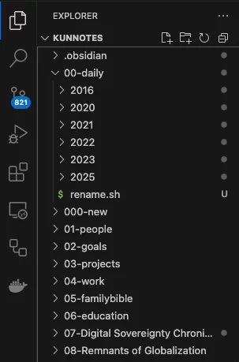
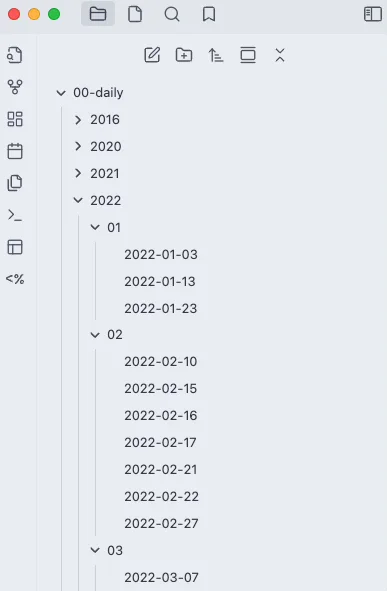

[](./8a022066-b14e-469e-aaa8-5b16ff6ee7db_940x314.webp)

I migrated from **Roam Research** to **Obsidian** a few years ago. Both second-brain productivity tools follow the **Zettelkasten** method to organize daily notes. So my library contains several thousand notes that are organized by dates. Roam uses the month-day-year filename convention that’s more prevalent in the United States, like “January 25th, 2023.md”.

This is very inconvenient. I wanted to use the naming convention of “YYYY-MM-DD” so that it would be “2023-01-25.md” and my library could be displayed neatly in any file system. I needed an efficient method to apply such changes to +5,000 files in bulk.

Thanks to **chatGPT 4o**, this potentially laborious task can be completed within 10 seconds by a shell script on the macOS Terminal app.

## 1. Shell or Templater?

Using a shell script or Obsidian’s powerful community plugin **Templater** can both accomplish the task. I went for the shell approach as it would give me more control over changes made to the files, which could be irreversible if something goes haywire.

Templater makes changes directly to the daily notes within Obsidian. It would probably be easier, but its power is a bit terrifying.

## 2. Find the directory

I place the vault (aka, the notes library) file of my Obsidian on iCloud so that it can sync across my MBP, iPhone, and iPad. This is not the best setup as ideally, I want to host this vault library on my Synology server at home. I’ll tackle that issue later.

iCloud has its idiosyncrasies as Apple doesn’t want users to poke around under the hood. It’s not easy to locate the path to my Obsidian folder from Terminal.app (I use iTerm2 as a replacement for macOS’ default Terminal.app). My vault is called KunNotes, so to enter into this directory:

```None
$ cd ~/Library/Mobile\ Documents/iCloud~md~obsidian/Documents/KunNotes
```

My vault looks like this (from VS Code):

[](./67337e64-ea26-4c17-bc2e-54be7200919a_303x459.webp)

## 3. Install tools

Need to install the **coreutils** library for my macOS (Sequoia 15.3.1) as the script would require a function **gdate.**

```None
$ brew install coreutils
$ brew link coreutils
Linking /usr/local/Cellar/coreutils/9.6... 256 symlinks created.
```

Verify that **gdate** has been installed properly

```None
$ which gdate
/usr/local/bin/gdate
```

## 4. Back up files

It would be prudent to back up the entire Obsidian vault (“KunNotes” in my case) in a separate directory outside of its default iCloud path. Changing filenames directly through the command line is an irreversible act.

## 5. Create a shell script

Go into the directory within the Obsidian vault where you have all the daily notes. In my case, that would be the ‘‘00-daily” folder. I have my daily notes organized by YYYY folders, then MM folders.

[](./3e097ab8-2165-45d2-b5f2-c3d7abc0d2f7_913x620.webp)

Create a script file **rename.sh** with the following code:

```None
#!/usr/bin/env bash
set -euo pipefail
IFS=$'\n\t'

# Function to remove ordinal suffixes from day numbers
remove_ordinal_suffix() {
  echo "$1" | sed -E 's/([0-9]{1,2})(st|nd|rd|th)/\1/'
}

# Function to convert date from "Month Day, Year" to "YYYY-MM-DD"
roam_date_to_obsidian() {
  clean_date=$(remove_ordinal_suffix "$1")
  gdate -d "$clean_date" "+%Y-%m-%d"
}

# Export functions for use in subshells
export -f remove_ordinal_suffix
export -f roam_date_to_obsidian

# Find and process all .md files
find . -type f -name "*.md" -exec bash -c '
  for file; do
    base_name="${file##*/}"
    dir_name="${file%/*}"
    base_name_no_ext="${base_name%.md}"
    new_base_name=$(roam_date_to_obsidian "$base_name_no_ext")
    new_file_path="$dir_name/$new_base_name.md"
    mv "$file" "$new_file_path"
  done
' bash {} +
```

Give this script execution privilege:

```None
$ chmod +x rename.sh
```

Then, run the script!

```None
$ ./rename.sh
```

Bang! All +5,000 files have just been renamed. Isn’t this beautiful (from my Obsidian window)?

[](./8b93a23c-ba47-4145-970d-6441c71701cf_387x591.webp)

## 6. Tips

It’s also a good idea to run this script in a single directory with a few daily notes as a dry run. If the script doesn’t work, the affected files are limited to only these few in this folder and won’t cause a vault-wide panic.

I was guided by chatGPT 4o on this fun quest. AI is a lifesaver!

---

Digital Sovereignty Chronicle is a reader-supported publication. To receive new posts and support my work, consider becoming a free or paid subscriber.
