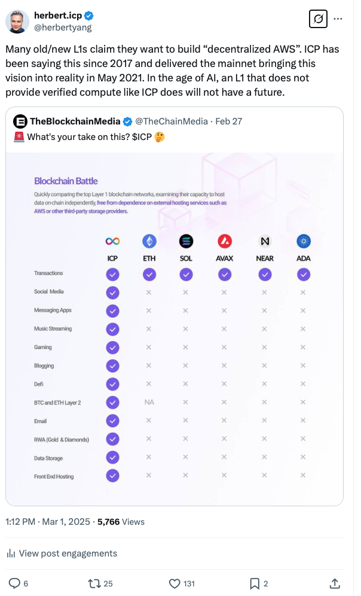
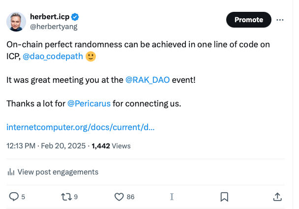
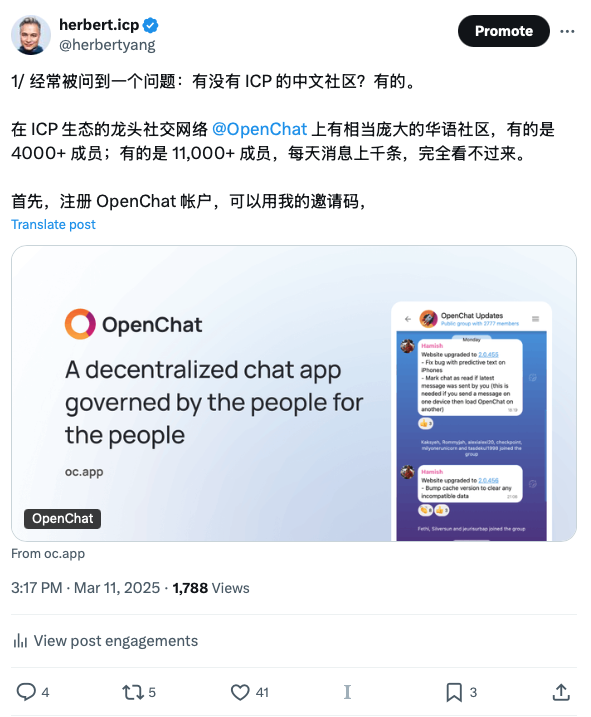

In case you miss it, here are the top conversations on [my Twitter](https://x.com/herbertyang) (original tweets only, not including retweets) in the last few weeks, since [February 7, 2025](https://digitalsovereignty.herbertyang.xyz/p/herberts-top-tweets-feb-7-2025). These topics received the most attention from the crypto crowd.

* This thread’s engagement level was off the chart, for my puny Twitter account that only has less than 9K followers. **Odin.fun** was catching on like wildfire. Could this be the iPhone 4 moment for ICP? Bob and the team have laid out a very exciting product roadmap in the coming months. Many are rooting for Odin.fun’s run at becoming the largest DEX on BTC.

* Comparison of **developer forum activities** with other L1 blockchain ecosystems turned out to be very favorable for ICP, a testament to DFINITY Foundation’s years of consistent and relentless R&D and Developer Relationship efforts. If you want to get a sense of the vibe and see which developer ecosystem is hot, this thread paints a vivid picture.

)

* Recently many other L1 blockchains are pitching themselves as “**decentralized AWS**”, a mantra that DFINITY first started in 2017-2018. This feeble attempt to pivot is, frankly speaking, quite laughable.

* Didn’t expect this spur-of-the-moment comment on **on-chain perfect randomness** could get so much attention. Among many other great features of ICP, this one could potentially find a huge market.

)

* Recounting my experiences with **[LLMs](https://digitalsovereignty.herbertyang.xyz/p/how-llms-supercharged-my-productivity)** seemed to resonate with a lot of folks. Though not a whole lot were converted into the subscribers of “**Digital Sovereignty Chronicle**”.

* Sharing ecosystem resource for **ICP**, especially for its Chinese community, was a big help for many. I should have written this earlier. It got asked too many times. I took this opportunity to pitch **OpenChat** again toward the Chinese but few were listening.

---

Thanks for reading Digital Sovereignty Chronicle! This post is public so feel free to share it.

[Share](https://digitalsovereignty.herbertyang.xyz/p/icymi-hot-topics-in-my-world-from?utm_source=substack&utm_medium=email&utm_content=share&action=share)
