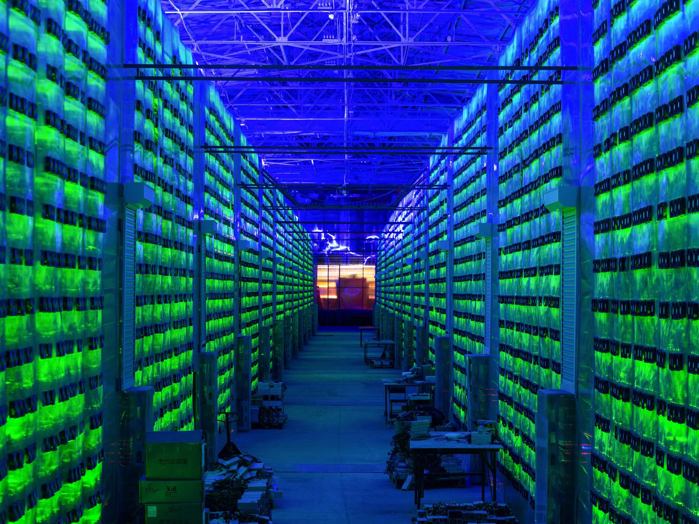

Crypto miners, in very broad strokes, keep blockchains alive.

---

Previously from **Decoding the Crypto Ecosystem Series**

1. [EP01 - Blockchains](https://digitalsovereignty.herbertyang.xyz/p/decoding-the-crypto-ecosystem-ep01-blockchains)

---

## What do they do

Miners can be split into validators and node operators. Generally speaking, they spend computational resources to participate in a race to calculate some mathematical algorithms that are very hard to solve but very easy to verify. When they successfully produce a new block, this blockchain's height is increased by one; more data from applications that are running on this blockchain can be written into this new block (and become immutable); the blockchain continues its growth and survives for another day.

A blockchain's most important characteristic would be its consensus model, which defines how a new block is produced and how multiple miners/validators arrive at an agreement on which block should be the next one. If a blockchain is a continuous self-writing history book, the consensus model determines how the history will be written and which facts will be recorded in the history, autonomously, without an all-knowing central authority, editor, or librarian.

The miners can be good, bad, or ugly. They may want to mine cryptocurrencies for upside potential. They may support a blockchain to advance its particular flag of decentralization. They may or may not know each other. They may want to collude to maximize their profits at others' expense. They may have malicious intent to hijack a blockchain. They may want to accumulate voting power to launch a community takeover (“CTO”). They may get lazy and want to chill on Wednesday. A truly robust consensus model would assume miners come in all shapes and try to make sure they can always reach an agreement, nonetheless. This is the whole point of decentralization. Developing a battle-tested blockchain consensus model requires tremendous R&D efforts in cryptography, game theory, and mathematics.

## How they collaborate

The consensus mechanism defines how miners collaborate to reach an agreement and get paid. Bitcoin uses **Proof-of-Work** ("PoW"). Ethereum switched from Proof-of-Work to **Proof-of-Stake** ("PoS"). Between these two extremes on the whole permission model spectrum, there are other forms such as **Proof-of-Useful-Work** (“PoUW” by Internet Computer) and **Proof-of-History** (“PoH” by Solana).

PoW says you can get paid as long as you commit hash power, which draws criticism for spending massive energy resources to solve seemingly useless mathematical formulas. PoS says you get paid by staking your tokens, which draws criticism for favoring big money players, stiffening competition, and hurting decentralization. PoUW says you get paid only when committing hash power to do useful work, like powering smart contracts.

Though more and more blockchains are adopting some variations of PoUW and PoS, PoW still has its charm in the hearts of many crypto fundamentalists. It gives everyone a fair chance to strike gold. It's pure. It's deterministic. It's a sure way to induce fear-of-missing-out ("FOMO"), the most potent weapon to jump-start a user community for a crypto project. Some memecoin projects introduce smart PoW-style mining to attract crypto users, such as BOB (Blockchain-on-Blockchain) and DOD (Doge-on-Doge).

## What’s in this for them

While the miners sound like the pawns for this complex game of one-ups and backstabbing, they're also the reason why this blockchain still exists. They receive tokens for this blockchain as rewards for committing considerable computation powers. If a blockchain's token soars, they make nice investment on their fixed assets.

Before crypto became the coolest kid in town, many IDC centers were provisioning their machines for cloud computing platforms like AWS and Google. Imagine if instead of receiving good old fiat dollars, they get paid in Amazon or Google stocks. That's why they're into this.

The crypto industry is in constant search for the next Bitcoin or Ethereum. A timeless proven mantra for mining is, regardless of whether it's for digging cold, oil, or Bitcoin,

**The early bird gets the worm**

If your marginal cost is low enough, go digging first before asking too many philosophical questions. Once you have a bag of sufficient tokens, you can then try to be a wise man and grow a conviction that this new token should be the next Ethereum killer.

## Who are they

The miners are a slightly different breed in crypto. Many of them are filthy rich, and by definition, they're the OGs ("original gangster", which means you discovered this alpha early and made nice money off it). Many come from the traditional hardware and IDC industry and have extensive practical knowledge about where to get the cheapest electricity. Many have built strong relationships with local governments in various countries. Many of them, frankly speaking, don't even understand or care about crypto that much. They have machines and know how to get cheap electricity. That's what it takes to be a good miner.

They may not be the most tech-savvy bunch. They cannot afford to let the machines sit idly. Whether it's Token A or Token B matters less to them as long as a room full of stacks of machines can generate SOME tokens. They are not so involved in market education initiatives like blockchains are. They don't do much PR. Their work is out of sight from retail users, but they follow every new blockchain with an intense gaze. Some of them also do investment, incubation, and community on the side, to double down on the tokens they are accumulating through mining. Some of them also participate actively in the governance of the blockchain, in terms of launching proposals and voting on them. Some of them even initiate Community-Take-Over ("CTO) when they are not pleased with the current leadership of the blockchain.

## From cradle to grave

Miners have a symbiotic relationship with blockchains. Before a blockchain launches its mainnet, it needs to recruit node operators all over the world. The permission mechanism reveals how decentralized a blockchain truly is. A blockchain with a high degree of decentralization, such as Bitcoin and Ethereum, would allow any miner to join the network automatically (or exit the network) by running the blockchain's script to start mining. Another blockchain with a lower degree of decentralization would still rely on a whitelist to manually approve who can become its node operators.

If a blockchain's token can't provide enough returns for the miners, miners will exit the network and repurpose their machines for the next chain that's more promising. The blockchain's network will dwindle, to the point where there are no enough miners to form a consensus to mint the next block. That painful, slow-death journey toward the end will take a long time to play out, though the writing might be on the wall long before.

## The Age of AI

Crypto mining has come a long way. In the early days, you could do mining on your laptop, and your puny CPU could get a hit once in a while. Nowadays, miners join mining pools, which aggregate individual machines’ hash power. Today's miners run professional data centers with hundreds or thousands of machines that power some of the largest infrastructure blockchains such as Chainlink, Internet Computer, and Filecoin. For retail crypto enthusiasts, they can still be either validators (which requires much less computer power) or participate in memecoins (which were all the rage in 2024/early 2025).

Crypto miners saved NVIDIA long before the second coming of the current AI revolution did. They used special-purpose **ASIC** (“Application-Specific Integrated Circuit”) machines to mine Bitcoins, contributing to a substantial portion of revenues for NVIDIA in its early days. In the current AI arms race, there is an insatiable appetite for every GPU chip produced by NVIDIA. Contrary to the wishful thinking of some Bitcoin enthusiasts, ***GPUs are not good at mining Bitcoins***. They're not energy efficient.

What would someone in possession of data centers do in 2025, hoarding every GPU chip for LLM training, or continuing to mine cryptocurrencies? The data center industry seems to be embracing a renaissance in 2025, fueled by big tech's race to build megaclusters. However, that hash power is increasingly consolidated within a few hands like Amazon, Google, Meta, Microsoft, OpenAI and xAI. This AI wave of transformers and LLMs is becoming very centralized, and the bar for entry is getting prohibitively high.

Maybe the more interesting game for old-fashioned miners is still in crypto, where, at least on paper, everyone still touts decentralization and strives toward that common goal. It's ***decentralization*** that gives everyone a chance, whether for an individual with only a laptop or a data center with truckloads of H200s.

I like to think (and the sooner the better!)  
of a cybernetic meadow  
where mammals and computers  
live together in mutually  
programming harmony  
like pure water  
touching clear sky.   
  
- All Watched Over by Machines of Loving Grace, Richard Brautigan

Thanks for reading Digital Sovereignty Chronicle! This post is public so feel free to share it.

[Share](https://digitalsovereignty.herbertyang.xyz/p/decoding-the-crypto-ecosystem-ep02-miners?utm_source=substack&utm_medium=email&utm_content=share&action=share)

---

Digital Sovereignty Chronicle is a reader-supported publication. To receive new posts and support my work, consider becoming a free or paid subscriber.
