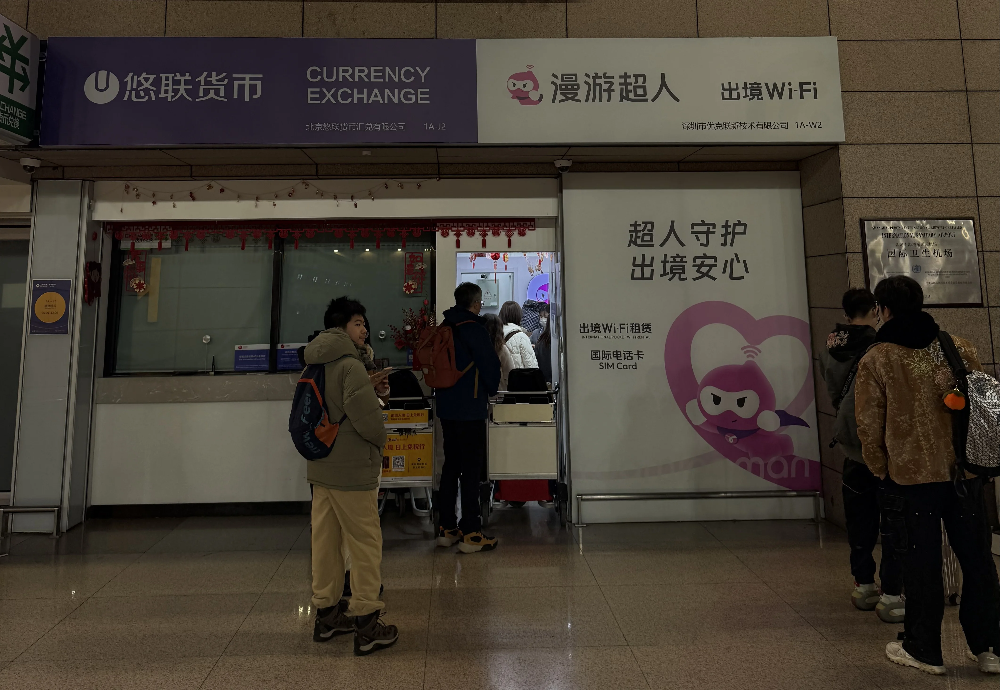

I travel a lot, mostly for short trips of 3-5 days in one destination country. I found that the best way to stay online on such short trips is to rent a wi-fi roaming station at the departing airport.

For example, if my home base is China, I should just get such a device from one of the several vendors, such as [Roaming Man](https://www.roamingman.cn) (漫游超人). It’s the size of your typical phone.

### What it provides

1. **Exceptional convenience.** The renting process takes 1 to 2 minutes. The return takes 1 second.
2. **Seamless transition.** You get online right away the moment the plane lands when you turn on this roaming station.
3. **Multiple devices.** You can connect multiple devices to one wi-fi station (usually up to 5). This is a God-sent for a family traveling with kids
4. **No restrictions.** Roaming Man's wi-fi station uses the telco service DIRECTLY from the destination country where you can get on Google, Youtube, Twitter, or Telegram. You don't get that when relying on the roaming service from your Chinese telco providers.
5. **Consistent speed.** You can get an all-day maximum 5G speed **GUARANTEED** in the destination country without worrying about degraded service.

### Why this is superior to other methods

* If you use the roaming service of your Chinese mobile number from a Chinese telco, you're still restricted from visiting many web services. You still have to use a **VPN** even outside of China, just for the sake of using Google Maps. When the VPN is ON, you cannot activate the hotspot of your phone to share your wi-fi connection with your traveling companions. Also, your roaming speed will be degraded if your usage exceeds a certain threshold. It's very annoying.
* If you rely on **Google Fi**'s popular global roaming service, lucky you! I was among the first gen of Google Fi users in 2018 (on an iPhone no less) and its global roaming was a killer. However, Google will pull the plug if it detects you've been outside of the US for an extended period. I don't have that roaming anymore from Google.
* If you try to get a phone card ("**burner**") in the destination country, it's a big hassle. First, burner phones are no longer available in many countries (such as China). Second, topping up the data plan for the phone number through some obscure, rarely used, third-party app could be quite frustrating. Third, such a burner phone’s data plan may not coincide with your travel dates, so you always end up paying more than what you need.
* If you try to get creative with an e-sim card, oh boy, that'll bring a world of pain. I tried that for a while with [5ber eSim](http://esim.5ber.com/?language=en-US), which is a physical SIM card holder that can be used on iPhones and stores up to **15** e-sim cards in its memory. Before every trip, I had to do some Google research to pick an e-sim vendor from the destination country from many, sign up for an account, buy a data plan, open up my iPhone, remove the current sim card, put in the 5ber eSim holder, activate the new eSim service after restarting the iPhone. This process is at least **half an hour**. Also, sometimes an eSim service simply doesn't work, because of some idiosyncratic APN settings related to the destination country that nobody knows.

### Pick-up and return

It’s super simple. Rent the device at the Roaming Man’s counter **BEFORE** you enter the gate/customs section. It’s usually right beside the entrance. No need to make a reservation. Just provide your cell phone number and pick up one with the maximum speed.

To return the station, drop it at the counter BEFORE you get to the carousel. If you miss that, you can just mail it back (no charge if within 48 hours).

I’ve used this service on many trips and am surprised to realize that many travelers are still not aware of this superior way of staying online in foreign countries. I’m a very happy user. Hope you will become one, too.
