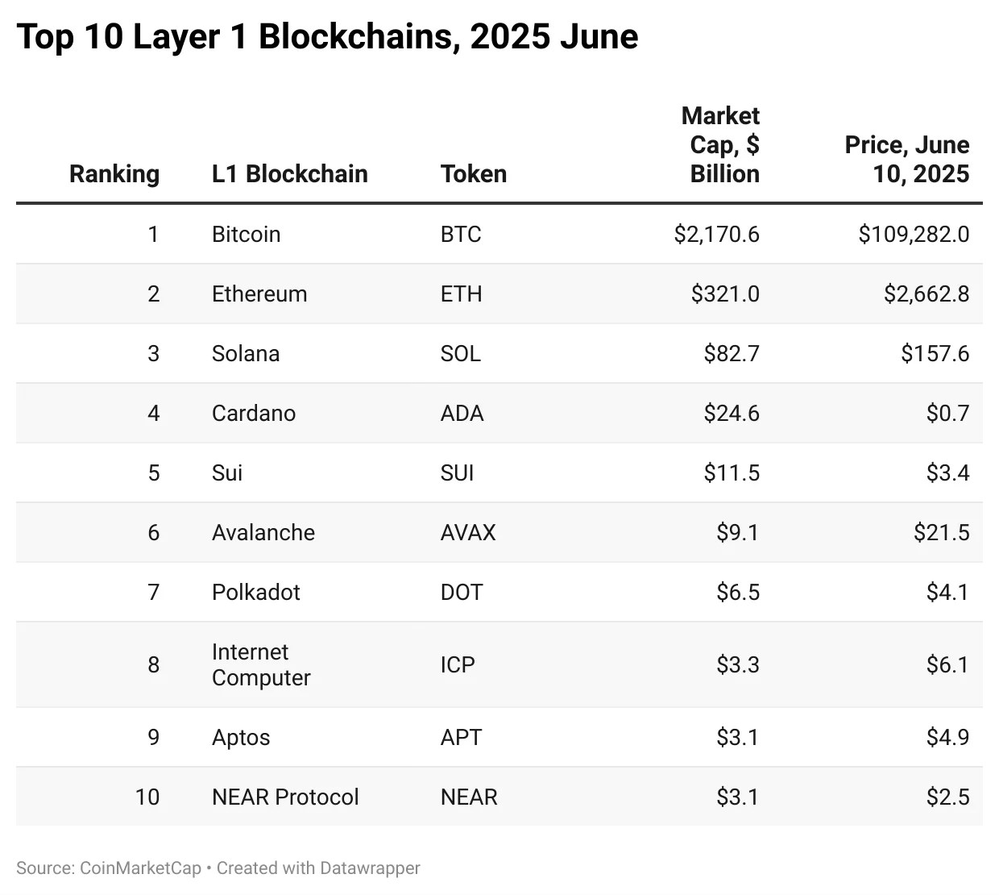
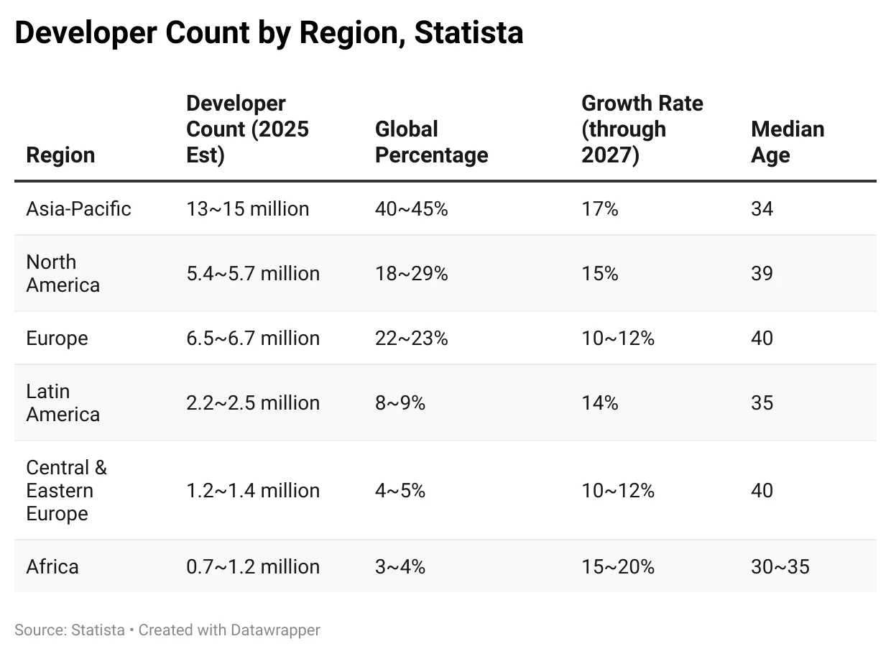
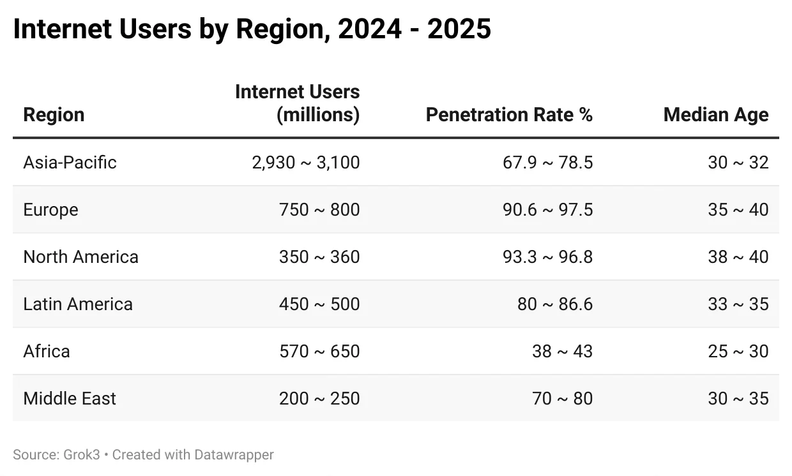
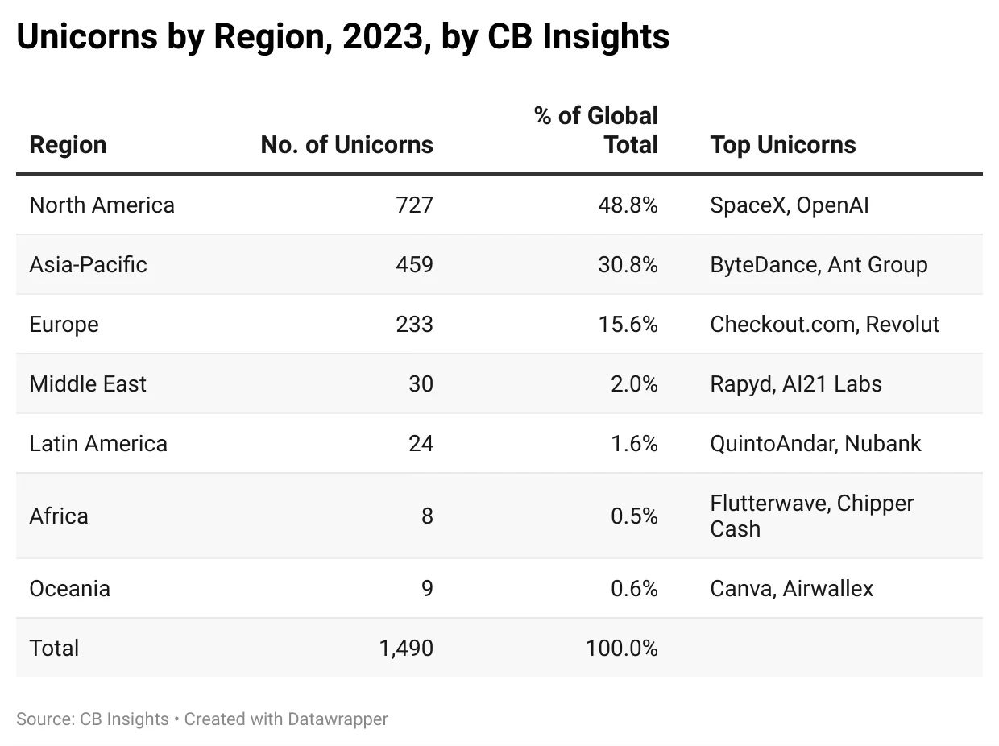

This is the first issue of a new series - ***Asia Crypto Ecosystem***. I will cover the importance of Asia, the challenges, tips for non-Asia teams, tips for Asia teams, and close the series with some practical suggestions for anyone interested in doing crypto in Asia.

### The Moat

In 2025, for a new business model to achieve growth, profit, and mass adoption, what would be its moat?

It's NOT technology innovation because the first mover advantage is diminishing fast.

It's NOT raised capital because every other worthy competitor has plenty of that, too.

It's NOT community because the community is constantly evolving and changing, if not revolting.

It's NOT liquidity because liquidity has no loyalty and will just mercilessly move to the next new thing.

It's NOT the founder because in an increasingly decentralized world, the founder’s role will gradually diminish.

The real moat is a well-oiled, vibrant **ecosystem** that allows all parties to collaborate and thrive.

From growing the startup ecosystem for Greater China (China, Hong Kong, and Taiwan) in **AWS** (Amazon Web Services) to launching a developer ecosystem for Asia in **DFINITY Foundation** (creator of layer 1 blockchain, the **Internet Computer**), I have been building technology ecosystems in the last seven years.

Asia is critical to the success of every blockchain ecosystem in crypto. If an ecosystem can't make it in Asia, it won't prosper globally, either.

### The Leading Blockchains

[L1 blockchain](https://digitalsovereignty.herbertyang.xyz/p/decoding-the-crypto-ecosystem-ep01-blockchains) is where the alpha lies in crypto. It is where technology innovations (decentralization and smart contracts) precipitate. While trendy dApps come and go, blockchains will persist for a long time. They're the backbones of the crypto industry.

*（This chart does not include memecoins like Dogecoin, stablecoins like USDT, exchange-based tokens like BNB, single application blockchains like Ripple or Monero, application tokens like Hyperliquid or Uniswap, infrastructure protocols like Chainlink, inactive blockchains with no developer activities, like Bitcoin Cash)*

More than half of the hash power for **Bitcoin** miners before 2021 was in China.

Crypto prodigy **Vitalik** hung out with Chinese friends in **Ethereum**'s early, humble days. The $500K investment from Wanxiang/Fenbushi (at $0.25 price) was a lifesaver for the Ethereum Foundation when it was struggling to find investors in the US/Europe.

More than half of the ecosystem projects of **Polkadot** came from Chinese developers.

Many large miners of **Filecoin** were in China.

Japanese enterprises played a key role in **Ripple**'s recent resurrection. They use Ripple for cross-border payments.

**Cardano**, which has occupied a top-10 spot on CMC (CoinMarketCap) for a long time despite few noticeable ecosystem activities, is carried by Japanese who are solid long-term holders.

One of the hottest new L1 blockchains, **Aptos** (spin-off from Facebook), found its footing in Korea. Its official website features English and Korean versions. The same goes for the **Terra** blockchain with its $LUNA token, before its collapse in May 2022.

The largest crypto oracle platform, **Chainlink**, has a huge team of 30+ in Asia. Its founder, Sergei, spent 3-4 months in Asia in recent years and is frequently sighted at many crypto events in Hong Kong, Singapore, and Dubai.

The largest L2 blockchain of the Ethereum ecosystem, **Polygon**, has a strong base in India. Its three Indian co-founders take turns to partake in every major event in Hong Kong, rubbing shoulders with the local government officials.

Another leading L1 blockchain that's riding the current AI wave, **NEAR**, saw its cofounder, Illia Polosukhin, spend two years in China during COVID-19. While that was probably not by choice, Illia was smart enough to use his time in China to build a strong bond with the Chinese developer communities.

The **EOS** blockchain, which was once billed as a formidable challenger to Ethereum and raised $4 billion in 2018, attracted every Chinese crypto OG to invest in its ICO, and many of them formed consortia bidding for its supernodes.

Before Andreessen Horowitz and Polychain discovered **DFINITY** (the lab that created the Internet Computer Protocol) and made heavy bets (fun fact: [ICP was the first crypto investment for Andreessen Horowitz](https://a16z.com/dfinity/)) in Series A and B, DFINITY had already found its early supporters from China. Many OGs there became angel investors of ICP.

Unlike the crypto VCs on Sand Hill Road in Silicon Valley, who took a very hands-off approach to their portfolio startups, Chinese investors like **Wanxiang Group**, **Hashkey Group**, **Fenbushi**, **SNZ**, and **ANMI Capital** became reliable long-term partners to the DFINITY Foundation and the ICP community. They continuously invest in ICP projects, collaborate with DFINITY in hosting hackathons, and invite DFINITY as title sponsors for their tentpole industry exhibitions. They might not be the best storytellers, but much stronger believers and doers.

Circa 2025, many emerging L1 blockchains came to Asia to host multi-city roadshows, such as **Virtuals**, **Story**, **0G**, **Gaia**, **Sentinent**, and **JAM** (from Polkadot). They understand that the Asia market would bring them not only the much sought-after critical mass in developer activities, but also quality dApps that would make the protocols shine.

### Crypto Exchanges

Crypto exchanges bring dreams (L1 blockchains) to reality (listing tokens and providing liquidity for exits). Sadly and realistically, they're the final destinations for crypto projects. This is where success is measured, score is settled, and billionaires are made.

Most of the current top 10 centralized crypto exchanges, as measured by trading volume, are run by Chinese or Asian teams, except for Coinbase.

T0: **Binance** was founded by CZ and He Yi

T1:

* **OKX** was founded by Star Xu
* **ByBit** was founded by Ben Zhou
* **Upbit** was founded by Korean [Song Chi-hyung and Kim Hyoung-nyon](https://www.forbes.com/sites/zinnialee/2022/04/20/cofounders-of-korean-crypto-giant-dunamu-debut-on-korea-rich-list/)
* **Coinbase** was founded by Brian Armstrong and Fred Ehrsam

T2:

* **Bitget** is now headed by Gracy Chen
* **Gate** was founded by Dr. Lin Han
* **Kucoin** was founded by Eric Tang and Michael Gan
* **Huobi** was founded by Li Lin. Huobi was rebranded as HTX after Li sold it to Justin Sun.

### Developers

Developers build applications using smart contracts that are developed by L1 blockchains. If an L1 blockchain cannot achieve mass adoption among developers, its decentralization technology innovations would not matter.

According to Statista, there are about ~28 million developers in 2024 globally, and that number would grow to ~35 million in 2025. Nearly half of that is in China-India. Asia not only far exceeds the US and Europe in the number of developers, but also growth rate.

Asia's developers are also much younger. Crypto is a young punk's game. Too much experience or knowledge from the old world of tech tends to create a barrier to understanding crypto.

Organizing offline developer activities (hackathon, hacker house, meetup, workshop, seminar, conference) in Asia would deliver the best ROI for a given marketing budget.

Many major blockchains did exactly that in 2024/2025. Solana moved its global developer conference **Breakpoint** from the Netherlands to Singapore. Chainlink moved its global developer conference **SmartCon** from Europe to Hong Kong. Ethereum moved its **Devcon2024** to Bangkok, Thailand. **Consensus 2025** was held in Hong Kong for the first time in early 2025.

### Users

The ultimate measure of success for an emerging technology would be adoption among users in retail/enterprise (though they may not necessarily be aware of the underlying infrastructure technology that is powering the applications they are using). Asia has such a significant share of the world's population pie that one could argue that, at least for Internet technology that is born without a border, this is the final and the most crucial battlefield.

### Applications

Users are amassed through applications. Asia accounts for 31% of all the unicorns (tech startups with at least $1 billion valuation) in the world in 2023, according to CB Insights.

Developers in Europe and America are very good at synthesizing multi-disciplinary domains of knowledge and creating highly abstract protocols. Most of the developer labs of L1 blockchains found their early engineers and architects in Europe and America.

Developers in Asia are very good at building battle-tested consumer-facing applications with rich features that appeal to every corner of human desire. The much bigger market allows them to conduct much more rigorous A/B testing with a much shorter feedback loop.

In 2025, the landscape for L1 blockchains is more or less settled. The existing L1s can offer enough narratives that can power through several cycles. The focus of the industry is on the application layer, which L1 ecosystem can empower developers to build paradigm-shifting applications that can create value for retail or enterprise users, and which applications can prove product-market fit for crypto, besides Bitcoin and Stablecoin?

Asia is mission-critical in all five pillars of the crypto ecosystem: **blockchains**, **exchanges**, **developers**, **users**, and **dApps**. Companies that are willing to overcome cultural and geographical barriers and invest in Asia will be rewarded in the long run. The jury is still out there.

Can't wait to find out in five years.

---

Digital Sovereignty Chronicle is a reader-supported publication. To receive new posts and support my work, consider becoming a free or paid subscriber.
