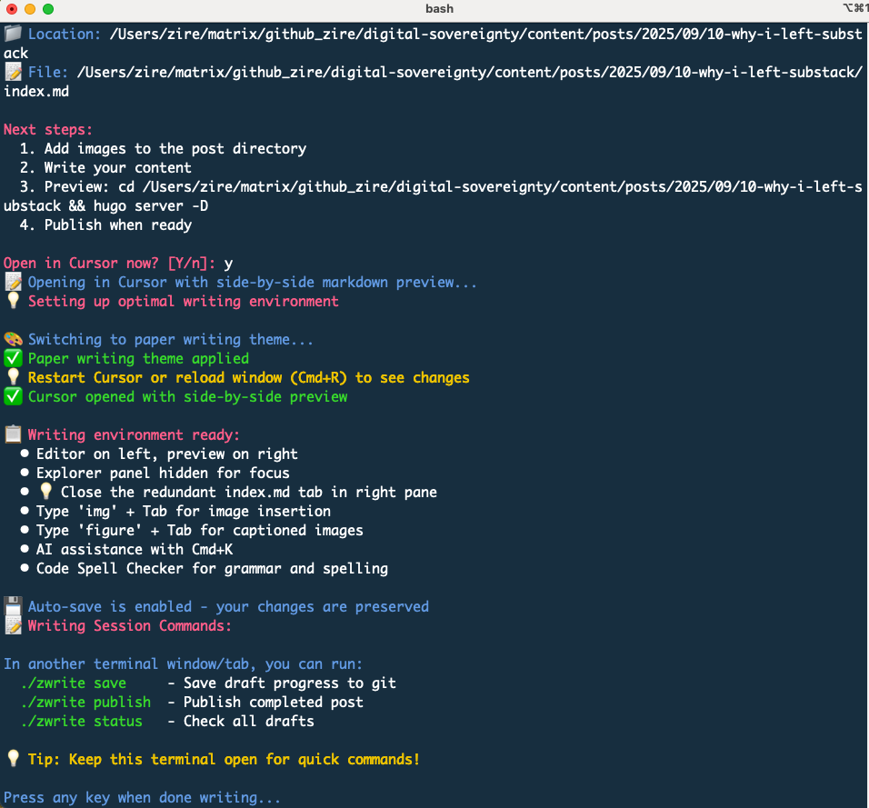

<!-- Featured image for social media -->

After six months of writing, I decided to leave Substack for good.

It was a Hail Mary move. Substack gave me a constant new flow of subscribers and followers. It helped me launch three newsletters. For a while I actually liked its workflow. It is very opinionated and gives me limited control. I was able to focus on writing and did not need to worry about how to make the newsletter beautiful or how to deliver the emails. Substack does a decent job of handling all that. The global community of like-minded writers is warm and friendly to beginners. I was occasionally scaling the chart for trending crypto writers.

But a few problems started lurking in the woods. They didn't go away and their shadow grew bigger.

The nastiest one is SEO - search engine optimization. You would think for an industry behemoth like Substack, this is a non-issue. SEO - or the ability for your website to be discovered by Google (and increasingly other LLM bots to farm their pre-training data) is so fundamental and essential for any website that I assumed Substack would surely nail it. Somehow, it was not happening. I struggled for months to get my three Substack-hosted sites to be indexed by Google (verified by [Google Search Console](https://search.google.com/search-console)) but guess how many pages have been indexed so far? 

Zero. 

I couldn't even get Google to index the `sitemap.xml` file. I tried every guide (many from Substack writers) and every suggestion from Reddit. On the surface, Substack seems to cover the basics - it provides `robots.txt` and `sitemap.xml` but under the hood, it uses heavy JavaScript to generate the webpage dynamically that probably doesn't play nice with the crawling bots.

It might be more than just the technical aspect of SEO. Substack is vying for supremacy to monopolize time and attention from content creators and influencers, in a battle against other social media giants like X.com, Meta, Linkedin, and WeChat Moments. To justify its valuation, it could no longer be content with beating just Medium. It started rolling out many new features to lure writers into spending more time on the platform. If you stay in the Substack universe, you get all the blessings but they are ONLY available on Substack.

So it's not surprising that it's not in the best interest of Substack to make SEO easy for its writers. It is sending a signal: if you want to discover good content, come to substack.com. Google or chatGPT will not get you my precious content.

Wait, I thought those contents were mine? From when do you think you're entitled to the ownership of the contents that I create?

One manifestation of this product design philosophy is that Substack forces you to use its web editor. 

This is very slow and inefficient. The best flow for a writer is to edit markdown files in tranquility with his/her preferred, offline editor, such as Obsidian, Typora, Macdown, or Ulysses, and click one button to publish them. A good writer writes everywhere, on the train, in the air, and in coffee shops, even in the far corners of civilization. It's naive to assume that an Internet connection is always available and that accessing substack.com is fast and reliable.

Also, I want to version control everything I write. It's part of my [CLAUDE.md](https://github.com/zire/claude-config/blob/main/CLAUDE.md). It's equally important for a writer as it is for a coder. Substack doesn't do that. Git is a foreign concept for Substack.

Sometimes I dreaded getting on Substack's web editor. It does not support Markdown. Its image upload breaks down easily depending on which browser you use. Grammarly doesn't always work. It creates all sorts of idiosyncratic issues that kill the joy of writing. 

For all these Silicon Valley unicorns, why can't they just focus on doing one thing, and one thing only? Why do they have to try to become the all-in-one stop for everyone? 

Another show-stopper for me is that substack.com is not accessible in China - as in the same case for every other major social media platform from Silicon Valley. For a new subscriber in China, he/she would have to figure out a way to visit a Substack-hosted site to complete sign-up. It can be done, but it requires a fairly technical solution that would be out of the comfort zone for most people in China. 

These are enough reasons for me to leave Substack for good.

But I'm not quitting writing. Aided by Cursor and [Claude Code](https://www.anthropic.com/claude-code), I was able to create a whole tech stack to host my newsletters that gives me total control of every aspect. I even created a [zwriter app](https://github.com/zire/zettelkasten-writer) that finally enables me to write in [Zettelkasten](https://en.wikipedia.org/wiki/Zettelkasten) style, a dream that Roam Research aspired to but never brought to fruition (I was an OG diamond member of Roam Research).

This site is now built with [Hugo](https://gohugo.io/), one of the most popular frontend frameworks written in the Go language. It's blazing fast with a build time measured in milliseconds. Email delivery is handled by a boutique shop [Buttondown](https://buttondown.com/), which integrates seamlessly with my [Stripe](https://stripe.com/) account for collecting subscription fees. The website frontend is hosted on an [Internet Computer](https://internetcomputer.org/) canister, which is a [smart contract](https://dashboard.internetcomputer.org/canister/wupbw-2aaaa-aaaae-abn7a-cai) deployed and running on one of the most decentralized blockchains with [13 redundant copies in a vast global network](https://dashboard.internetcomputer.org/network/subnets/shefu-t3kr5-t5q3w-mqmdq-jabyv-vyvtf-cyyey-3kmo4-toyln-emubw-4qe). My site can now be visited by anyone in China without any exotic wizardry.

More importantly, this canister stores all my content for this Digital Sovereignty Chronicle. I'm the only one who controls this canister, without reliance on any centralized platforms like AWS or Substack. I can choose to give my control to someone else (such as my descendants) so that my writing will persist through generations. I can even designate my canister for community donation through another wonderful tool powered by Internet Computer, [Tipjar](https://tipjar.rocks/) , so that my subscribers can donate cycles to power up this canister continuously and collectively, in perpetuity, if they find the content of this newsletter site useful (if not the least as a last feeble attempt to record human's thinking and reflections before machine's take-over). This is independent of my physical existence and only requires the continued existence of the [Internet Computer blockchain](https://digitalsovereignty.herbertyang.xyz/p/decoding-the-crypto-ecosystem-ep01-blockchains/).

This means immortality, the ultimate goal for man.

I write Markdown files in [Cursor](https://cursor.com/home) with side-by-side Markdown Preview, in a paper-like theme that Claude Code tailor-made for me. I use [Code Spell Checker](https://marketplace.visualstudio.com/items?itemName=streetsidesoftware.code-spell-checker), an extension for VS Code/Cursor, for spelling checking.

My entire flow is version-controlled with git and synced to my GitHub account. I literally press one button in [zwriter](https://github.com/zire/zettelkasten-writer), which is a Shell-based app, and let zwriter handle all the git add, git commit, git push and merging of this PR to the `main` branch, which will then trigger a Github action script that automatically deploys the canister and updates the production site. Buttondown will pick up the new RSS feed and send out emails to all my subscribers. 

My writing loop is now 100% offline. The only time it needs Internet access is when I publish the article, which is through a series of git commands in a Shell window. It takes 1-2 seconds to finish.

Now I feel at home. 

I'll write more on this journey to Terminus. Stayed tuned.

---

*Published in [Digital Sovereignty Chronicle](https://digitalsovereignty.herbertyang.xyz/) - Breaking down complex crypto concepts, exploring digital sovereignty, and sharing insights from the frontier of decentralized technology.*
