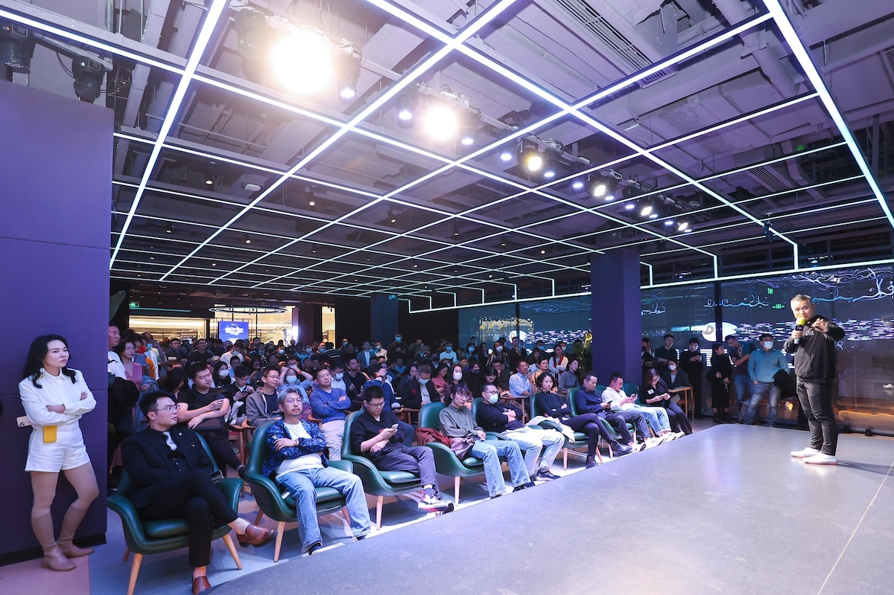
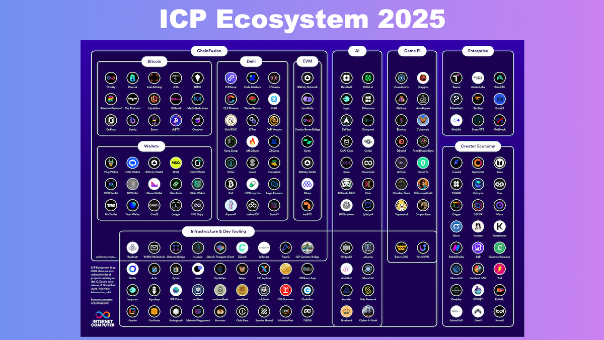

<!-- Featured image for social media -->

---

Previously from **Decoding the Crypto Ecosystem Series**

1. [EP01 - Blockchains](https://digitalsovereignty.herbertyang.xyz/p/decoding-the-crypto-ecosystem-ep01-blockchains)
2. [EP02 - Miners](https://digitalsovereignty.herbertyang.xyz/p/decoding-the-crypto-ecosystem-ep02-miners/)

---

## Introduction

Developers build applications. In the crypto industry, they build decentralized applications, or dApps. In traditional Silicon Valley, "startup founders" get a lot more attention, especially when they attend Y Combinator's Demo Day event or are mentioned in Forbes' "30-under-30" list. "Code is law" is the mantra in the crypto business, and the cypherpunk culture is deeply rooted in the community's emo.  Therefore, developers, who are by definition coders, are the darlings of crypto. They carry all the hope and inspiration. 

## Founder's Journey

That inspiration often happens at a serendipitous encounter with a [blockchain-hosted event](https://x.com/herbertyang/status/1452500111695638531). Developer Bob learns about an up-and-coming new blockchain, which usually boasts a grandiose vision to completely change the industry, the world, and the civilization. Maybe Bob is just intrigued by the speaker's passion and eloquence. He checks out the documentation for this [new blockchain](https://digitalsovereignty.herbertyang.xyz/p/decoding-the-crypto-ecosystem-ep01-blockchains) and finds that the [foundation](https://digitalsovereignty.herbertyang.xyz/p/why-non-profit-in-crypto/) behind this blockchain just launched a grant program to incentive developers to try out the software development kit (SDK). Bob builds a Hello-World app using the SDK in five minutes. This looks legit. 

Bob starts building on this blockchain. He participates in a hackathon organized by the foundation, joins several online workshops, deepens his knowledge and skills for the particular smart contract of this blockchain and its preferred language (usually Rust), and makes the cut for the demo day. In a surreal moment, he meets the founder of the blockchain, who is like Jesus walking on water in the eyes of his feverish fans. Bob becomes a believer and wants to be part of that paradigm-shifting, greater success.

With his credentials as a finalist in the hackathon, Bob receives a grant from the foundation. He pings the DevRel (Developer Relationship) team of the foundation every now and then for questions. He comments and debates on the [official developer forum for this blockchain](https://x.com/herbertyang/status/1889520294035128812), which is run and moderated by the foundation. He slowly builds up a reputation on the forum and in the community. His Twitter following grows, which is highly correlated with, if not capped by, the popularity of this blockchain. If Bob speaks good English, he becomes a thought leader or, even better, a KOL. He starts writing in threads or Tweet storms as he's confident that his writing should be read by all other developers in the same ecosystem. This is the way.

As his conviction grows, Bob assembles a team. He might even leave his Web2 job to pursue this Web3 career full-time. The team is usually distributed all over the place and everyone just works from his/her comfortable home. Renting an office is expensive and so not cool. Bob convinces Alice to join the team to lead BD/marketing/community. It's always an Alice, not a Jerry. Bob and his coder friends continue to build the dApp. Alice is trying to get some early users on Twitter, Discord, and Telegram.

## Developers & Blockchains

For a layer one blockchain, developers are the real target users. The open-source technology created by the foundation - the developer lab of the blockchain, is at the protocol or infrastructure level. The protocol would not be useful at all without adoption in the developer community. Blockchain foundations rely on these developers to create killer apps that would turn heads in the industry, such as **Uniswap** for Ethereum or **Pump.fun** for Solana.

Therefore, it's not an understatement to argue that the vibrance and the strength of a blockchain ecosystem can be measured by one single metric - developer activities. [The Global Developer Report](https://www.developerreport.com/reports/devs/2024) issued by **Maria Shen** of **Electric Capita**l (one of the largest crypto funds in the world) has become the standard bearer on this. It's way more useful and insightful than **Mary Meeker**'s utterly useless Trends - Artificial Intelligence Report, which becomes obsolete the moment it's released, despite BOND Capital's supreme and unjustified confidence that people in 2025 would still read a report of 340 pages, on AI, of all things.

Though the foundation is rooting for the success of all the developers in its nascent ecosystem, it needs to tread water very carefully in an act of delicate balance. Many developers are professional grant shoppers - they excel at winning hackathons and go around all the major foundations to apply for grants. In a bull market, many developer teams think they can become the next Uniswap and proudly claim they're platform-agnostic. It implies that they can hold the court with all major blockchain ecosystems and thrive on their own, with or without explicit endorsement of any particular L1/L2 blockchain. 

The reality is a lot more nuanced. One major difference between Web3 and Web2 is that, the foundations that create L1 blockchains wield considerable power in shaping the future direction of the industry. In Web2, even the mighty AWS (Amazon Web Services) is just a tech vendor. It does not have the power to tell ByteDance or RedNot what to do because those superapps' core technology stack is not dependent on AWS. Cloud computing is just another cost layer, albeit a critical one, that can be swapped in and out, if the customer has enough money. In 2025 you don't hear a successful YC startup proclaiming we nailed our product-market fit because we use AWS. They would only casually mention that their founder knew Alexandr Wang when they hung out at IOI training camps together, like, 15 years ago.

In Web3, very few projects can achieve such an exalted superapp status that makes them truly platform agnostic. Bob has to pledge his allegiance to some flag - House of Stack or House of Lannister. This is how we roll in the industry. You can't be a lone wolf. In Web2, founders gather around T1 VCs, accelerators and vertical-focused events. In Web3, developers gather around L1 blockchains and T1 tentpole events. [Endorsement from a leading L1 blockchain](https://internetcomputer.org/ecosystem?tag=dapp) goes a long way for developer Bob.

 

A L1 blockchain loves those developers who build exclusively on its chain, so that the chain can claim "this killer app was born natively from our chain". Developers on the other hand, often go on mating dances with other blockchains, just to get more grants to survive to another day. 

There is no right or wrong in this relationship. They both need each other to grow to the point of mass adoption. They grumble about unequivocal love and reluctantly hold hands together at the next Token2049 event.

---

*Published in [Digital Sovereignty Chronicle](https://digitalsovereignty.herbertyang.xyz/) - Breaking down complex crypto concepts, exploring digital sovereignty, and sharing insights from the frontier of decentralized technology.*
