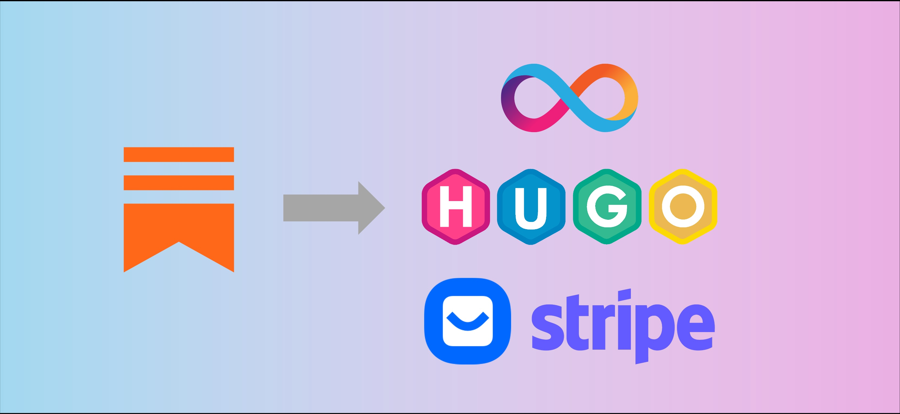

<!-- Featured image for social media -->

[Moving your newsletter away from Substack](https://digitalsovereignty.herbertyang.xyz/p/why-i-left-substack/) to a self-hosting platform consisting of **ICP**, **Hugo**, **Buttondown** and **Stripe** is a strenuous journey, but I'm very glad that I made that move. I now have a very high degree of control of every aspect of this flow end-to-end, from the visual presentation of the newsletter, its mission-critical SEO (search engine optimization), to customization of unique features. I do 100% of my writing in offline mode. The entire online loop from publishing the articles to sending out emails to subscribers is triggered with one single command, and the rest is all executed autonomously. 

I can finally go back to writing in **Markdown** and my drafts are version-controlled with a sync to my private repo on **GitHub**.

Most importantly, I can focus on writing and curating high-quality content and not have to play those silly platform games on Substack anymore. They've become very distracting.

I migrated three newsletters from Substack in the last few months. Here's a walkthrough reference for myself (as if I have more newsletters to migrate 🙄) and other writers who might feel the same itch. 

## Step 1: Select a hosting platform

Substack seems to use **AWS** (Amazon Web Services), evidenced by its storage of images on AWS S3 servers. Managing your own AWS EC2 instance (virtual private server) is a complex task and it can get expensive quickly. 

Other hosting services like **Replit** and **Vercel** are major improvement over hugely bloated **WordPress**, but they're still centralized platforms. If you've come this far to stumble upon this article, you probably care about *decentralization* and *digital sovereignty* a lot. You might as well go all the way to the other end of the spectrum with the **Internet Computer** ("IC", or "**ICP**"), a decentralized AWS that can host your website in its smart contract deployed on a blockchain.

Why build on ICP? It's a lot cheaper and easier. You get 100% control of your content. No other tech platform can give you that claim. This might not be essential for most people, who just read and consume. For writers who want their words to become part of human history and persist for a long time, this means a lot. You think Amazon, Microsoft, Alibaba, Meta, and Google can still be around 50 years from now? Think again.

I'll explain how to build a static website on an IC canister (which is a smart contract with `400 GB` stable memory, sort of a light-weighted Docker) in a future post. 

## Step 2: Build your own frontend

Subtack provides out-of-the-box newsletter templates with customization options. They do look professional but are quite limited. In a non-Substack world, we need to build our own website for the newsletter, which shall be a static website. A dynamic website would be an overkill for most writers. 

There are many static site generators (SSG). I've used many, from Pelican (**Python**-based), Jekyll (**Ruby**-based), to Ghost (**JavaScript**-based).  There are also many frontend frameworks, such as **Angular**, **Vue**, **React** and **Svelte**. 

After having experimented with all of them, I go with [**Hugo**](https://gohugo.io/), one of the most popular and fastest growing frameworks in 2025 built on the **Go** language.  Its build time for this site ranges from 50~100 milliseconds and my deploy script on Github often finishes in less than 30 seconds. It's extremely fast. It renders **Markdown** files into static HTML pages. Substack's lack of Markdown support is a major turn-off for me.

- Create a scaffold project with Hugo and `dfx` (the command-line interface for the Internet Computer Protocol) and initiate that as a git repo.
- Create a new dfx identity and export its private key (in the form of a `.PEM` file) to the Github repo for CI/CD action script.
- Create a new canister with this dfx identity. 
- Pick a theme for the Hugo site. I like [diary](https://github.com/AmazingRise/hugo-theme-diary) and [paper](https://github.com/nanxiaobei/hugo-paper). Both are minimalistic and free. 
- Build a GitHub action script to deploy the website in the IC canister  automatically upon triggers from `git push` into the `main` branch. 
- Download all the posts and emails from Substack. Fortunately, Substack still allows that.
- Based on the content structure of the chosen frontend framework and the theme, reformat the downloaded HTML files into Markdown ones, and add the appropriate frontmatter. 
- Make sure the URLs for the posts are consistent with the published articles from Substack, so that you will not lose the SEO ranking.
- Adopt *page bundling* by grouping all the embedded images into the same folder as the article. Use `imagemagick`, a powerful command-line tool, to reformat images if necessary. Convert HEIC images into Google's webp format (HEIC from Apple is not widely accepted and creates many compatibility issues). Set a maximum width of `1200px`. Make sure no image should exceed `500KB` in size.
- Set up `categories` or `tags` if needed. I like category better because it requires the writer to make only one decision. Tags require writer to make too many decisions that are just mentally exhausting.

Once your posts leave the Substack platform, you will loose the relationship between the posts and the embedded images for those posts. During the download of posts, you can still identity image-01.jpg and image-02.png as related to post-01.html, but you won't be able to tell exactly where those images are placed in the original article. I went through this pain when migrating from Wordpress to Pelican 10+ years ago and had to go through this again when migrating from Substack to Hugo. 

That's why I only want to write my articles in **Markdown** using **page-bundling**. This is the most efficient way to retain the canonical relationship between the text body and the images. It is platform agnostic. I can easily migrate my content to any other future platform if needed. 

**Claude Code** and **Cursor** were very handy in helping me create sophisticated Shell scripts to automate the above heavy tasks of file manipulation.

## Step 3: Configure custom domain

Your website is up and running on a blockchain  - https://wupbw-2aaaa-aaaae-abn7a-cai.icp0.io !  You can check the [status of this smart contract `wupbw-2aaaa-aaaae-abn7a-cai`](https://dashboard.internetcomputer.org/canister/wupbw-2aaaa-aaaae-abn7a-cai) on the IC Dashboard. This is cool but not easy for readers to remember. 

You can use your own [custom domains](https://internetcomputer.org/docs/building-apps/frontends/custom-domains/using-custom-domains) and point your deployed IC canister to that domain.

So now when people visit https://digitalsovereignty.herbertyang.xyz , they're actually visiting a smart contract deployed on a blockchain, https://wupbw-2aaaa-aaaae-abn7a-cai.icp0.io . For viewers, they don't feel any different from looking at a website deployed on a traditional cloud server (AWS, Google, or Digital Ocean). But for the writer, you're the ONLY one in the world that can control this canister `wupbw-2aaaa-aaaae-abn7a-cai` and all the articles and images stored in it. 

The only assumption you need to make is that ICP, as a [blockchain infrastructure](https://digitalsovereignty.herbertyang.xyz/p/decoding-the-crypto-ecosystem-ep01-blockchains/) that hosts your smart contract, will be around for a long, long time. 

This topic will lead to a much bigger philosophical debate and fall outside of the scope of this article. Nothing is for certain in 2025, but I'll bet my money on a decentralized technology platform to send greetings to [Trisolarans](https://three-body-problem.fandom.com/wiki/Trisolarans).

## Step 4: Set up email delivery

Despite email's ubiquity and utility-like nature for web users, sending and receiving email is a formidable technical challenge. An email delivery service provider, whether that's **Mailchimp**, **Mailgun**, **Substack**, **Medium**, or **Dmail**, has to jump through many hoops to successfully deliver an email to the recipient, in a nice, intended format.

Mailchimp is expensive for early-stage writers, and Mailgun is better for transaction emails. I chose a no-bullshit, niche player, **[Buttondown](https://buttondown.com/)** for its tight integration with **Stripe**.  So far, I'm a very happy customer. It operates three newsletters for me, including sending out emails, managing subscriber lists, creating sign-up/unsubscribe automation loops, and providing simple user interaction analytics. 

- Configure the custom domain in Buttondown to make sure emails will be sent out from YOUR domain. You need to go through a verification process to prove that you are the owner of the custom domains.
- Create a sign-up/subscribe page (or a footer, or a shortcode in the Hugo world) to acquire subscribers. Also design the email template for the double opt-in confirmation and unsubscribe. Test this loop thoroughly. 

## Step 5: Create RSS feed

For a static website, the most straightforward method to send its latest newsletter articles to a mailing list is through **RSS** (Really Simple Syndication). It's a protocol in the form of `.xml` file that tells RSS aggregators that the website has just been updated with new content. 

Buttondown will check the RSS link to the newsletter site every `30~60` minutes. If the xml has a new version, Buttondown will send out emails to the subscribers. It's  crucial to configure the RSS feed correctly. 

Surprisingly, configuring RSS is way more scientific and harder than I expected. I spent probably the most time in this step in the entire migration endeavour. 

- Usually the generation of the `index.rss.xml` is already part of the frontend theme. It will be generated when the frontend site is built and Markdown files are parsed into HTML files. However, do not assume that's the best way to create this xml file, or it is exactly what you want. 
- I had to tinker with the template `xml` file A LOT to tune it to my preference. For a newsletter site, arguably, the email is even more important than the website. No matter how you style the website, if the email doesn't look nice, all your effort is wasted.
- Testing email's visual look is ticky. Unlike a website that you can easily see the effect on `localhost` developer server, it is hard to replicate the look of email, which is also affected by various email service providers. Google, Proton, Outlook, QQ, they all handle emails differently and try to impose their own rules of how to render an email.
- Make sure the `baseURL` setting in the frontend framework is correct.
- Make sure to use `absolute URL` in RSS, not relative URLs.
- Set the correct `timezone` in the theme configuration. If not, Buttondown may wait for hours to initiate sending.
- Validating the RSS integration, from the email format to Buttondown trigger, is a test of patience. Sender's name, email title, footer, every detail matters.

## Step 6: Import email list

The email hoop is now complete. You can import subscriber email list from Substack. It's probably useful to send out a short email to explain the migration but I didn't. For my subscribers, they would not feel anything different, other than seeing the different look on email and the website. The URL links and even the Stripe payment relationship remain the same.

## Step 7: Integrate Stripe

Substack charges `10%` of the money content creators  collect from their subscribers. In this new setup, `100%` of all the subscription fees go to the writer. Hugo is an open-source, free framework. Many Hugo themes are free. I'm on a `$29.00`/month tier with Buttondown, which allows me to manage three newsletters with a rate limit on the number of emails I can send out. Stripe charges a small transaction fee. 

Once the new markdown-writing-email-sending loop is kicking into high gear, it's time to integrate Stripe to turn the newsletter into a revenue-generating business. It's fairly easy to hook up Stripe with Buttondown. The founder of Buttondown used to work as an engineer in Stripe. 

You can create a new product (or just use the existing product that used to be integrated with Substack) with several pricing tiers. Buttondown will pull those product/pricing combo from Stripe. The key is to make sure when users click on the appropriate button on your newsletter site, they will be redirected to that product page on your Stripe account.

## Step 8: Improve SEO

Substack provides very few options to fine-tune your website's SEO. As mentioned in ["Why I Left Substack"](https://digitalsovereignty.herbertyang.xyz/p/why-i-left-substack/), I had major beef with that. Now I can do whatever is needed to optimize the SEO of the site. 

It's mainly `sitemap.xml `and `robots.txt`.  [Google Search Console](https://search.google.com/search-console) and [Google Analytics](https://developers.google.com/analytics) are two essential tools. In the age of AI agents running rampant, if your site cannot be indexed by LLM bots, you do not exist.  SEO will warrant an article on its own.

Though my site keeps the same URL links through this Substack migration, Google still seems to discriminate its pages. I have the feeling that Substack has left a bad taste for Google. It might take a while for Google's crawling bots to realize this site has quietly replaced its engine and is now just a harmless writer who wants to acquire his own 1,000 fans with no ambition to turn that into a VC-backed multi-billion behemoth. 

I am glad I left Substack early. I would have accumulated too much technical debt had I not completed this sooner. Way to go!

---

*Published in [Digital Sovereignty Chronicle](https://digitalsovereignty.herbertyang.xyz/) - Breaking down complex crypto concepts, exploring digital sovereignty, and sharing insights from the frontier of decentralized technology.*
