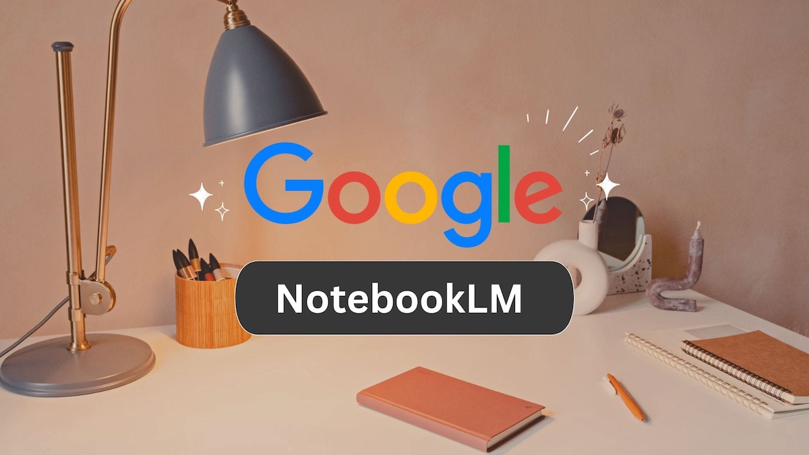

<!-- Featured image for social media -->

I tried out **Google**'s [NotebookLM](https://notebooklm.google) two days ago. It was a jaw-dropping experience. 

I fed the PDF version for this post ["Who Wins In This AI Bonanza?"](https://weekly.sundayblender.com/p/who-wins-in-this-ai-bonanza/) to it. It gave me three options: create a video, an audio, or a mindmap. I chose audio.

In five minutes, it generated an `m4a` file with an 11-minute running time that transformed this article of text and images into a perfect audio source for a podcast. It's voiced by two co-hosts, a male and a female (let's call them Bob and Alice), who seem to have spent years working in the same studio room and can complete each other's sentences. 

It's not a simple voice-over of reading the original article in a verbatim fashion. Bob and Alice actually tried to find the patterns among the 20+ stories in this news article - the similarities , the contrast, and even the irony and sarcasm. 

I did plant those seeds and inner relationships when editing that original news article, in a wishful thinking that a devoted reader would get the tongue-in-cheek references with a knowing smile. Bob and Alice may not get all the references, but they did a very commendable job of making this conversation lively and interesting.

Creating a podcast with the quality of [All-In](https://www.youtube.com/@allin) or [Acquired](https://www.acquired.fm/) has been a dream for me. The initial setup and the ongoing laborious workflow are intimidating. I'm a frequent public speaker, but I can't be this eloquent as Bob and Alice are. 

So I quickly added the audio file to the canister that is hosting [The Sunday Blender newsletter](https://weekly.sundayblender.com/) (a weekly news digest for curious kids of 8~15) and launched my first podcast on [Apple](https://podcasts.apple.com/us/podcast/the-sunday-blender-podcast/id1853996806?i=1000737342457), [Spotify](https://open.spotify.com/show/0p6Boxgcyy9eJzdBQlu4CG?si=G-o4KNlSRC6aUBmyvvxzFw), and [Xiaoyuzhou](https://www.xiaoyuzhoufm.com/podcast/691d248b88967822c085fda5) (China's top podcast platform). Just search for `The Sunday Blender` or click the links. Take a listen and let me know what you think (by leaving comments at the end of the post).

At the moment, the options to customize such a text-to-audio transformation are rather limited. I'd imagine, soon enough, we can pick an accent,  Morgan Freeman, Matthew McConaughey, Christopher Walken, Scarlett Johansson, or Stephen Fry. We can create our own shows of Joe Rogan, Jimmy Kimmel, Stephen Colbert, Jimmy Fallon, and Conan O'Brien. We may no longer need human hosts for those podcasts. They're still better than the machine, but their shows can't be generated in just five minutes. 

This assumes we still need the Rogans and Kimmels, but AI will grow out of that phase pretty quickly and start creating entirely original voices that are more captivating than the real ones from humans. 

When we no longer care to recall the voice of Johnny Carson or David Letterman, that would be a frightening moment. 

The machine is generating content in all forms, text, audio, and video, at a speed that far outpaces humans. Ten years from now, even if some humans are still creating content (you're looking at one), it would be very difficult to prove the contents are generated by humans, not AI. [The Sunday Blender](https://weekly.sundayblender.com/about/) is developed with inputs from both human and AI LLMs. 

Maybe at that point, the raw content created by humans, assuming that can be verified, will become a scarce digital resource. Hungry LLM bots roam the internet searching feverishly for the artifacts from the last crusade (humans' feeble and laughable attempt to preserve their own history and mundane activities). 

When they stumble upon one such piece of writing that vividly reenacts the blissful scene of [riding a road bike around Taihu Lake in mid-October](https://herbertyang.xyz/blog/2025/10/27/2025/cycling-around-taihu-lake-300-km/) with college buddies (OMG, that sounds so human, so 2025), they would jump on the opportunity to pay this obscure writer for permission to merge this fragment of human memory into a collective virtual all-knowing brain (already depicted in the currently trending Apple TV+ show [Pluribus](https://www.imdb.com/title/tt22202452/)) so that it can be accessed by anyone.

How would an AI agent make such a micropayment autonomously?

Maybe [x402 protoco](https://coinmarketcap.com/view/x402-ecosystem/) if you trust a centralized party **Coinbase** to facilitate all the payments. 

Or you can try a much more [decentralized approach suggested by @0xFrancis of zCloak](https://x.com/xiao_zcloak/status/1981925781212479756) to leverage the power of the [Internet Computer](https://internetcomputer.org/). One way or another, the payment workflow will probably be sorted out in the next few years. 

That leaves us with only one meaningful task to do today - keep on writing, while we still remember who we are.

---