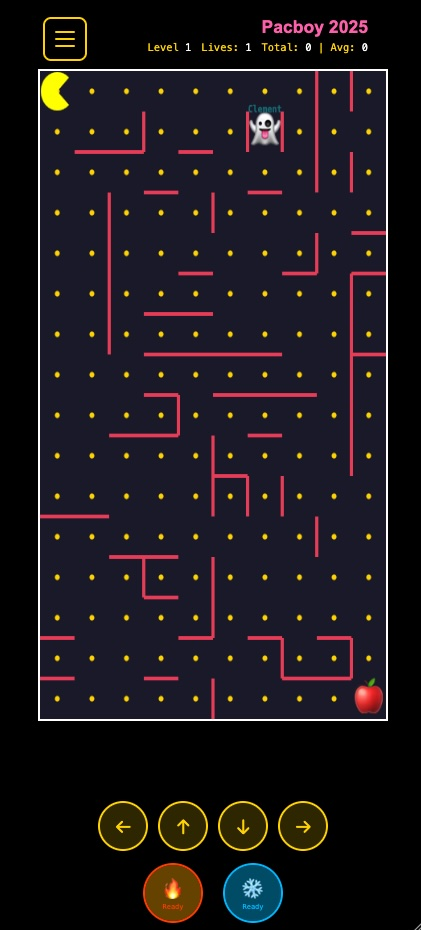

## The Cursor moment of wow

I started vibe coding early this year. One of the projects I was incubating got stuck in the MVP (minimum viable product) phase. I put on the hat of product manager, opened a **GitHub** kanban board, unleashed 20+ issues related to UI/UX in a flurry fueled by creativity outburst and founder's anxiety, and labeled them meticulously by issue type with cute colors. 

Then I waited for the frontend developers to fix them and close all these to-do items.

Nothing happened. It was a team of part-timers. Everybody had other priorities. The developers seemed to have made many changes offline that were not synced to GitHub's code base. Documentation was sparse and not up-to-date. The code could not even compile successfully. 

[Cursor](https://cursor.com/) was buzzing and eating the lunch for good old **VS Code**. I had not used an IDE (Integrated Developer Environment) for more than 10 years since the days of running a 10-person engineering team for my Silicon Valley startup. But what the heck. As a serial startup founder, I am used to taking things into my own hands.

I tried out Cursor and it was an incredible experience. I created from scratch a fully fledged frontend app with [React](https://react.dev/) framework within three days. It was mobile responsive right from the start - a major challenge for the legacy version. It had all the features I wanted from that quiet kanban board. I could tinker with every button, every paragraph, every screen in real-time on the development server, however I want, whenever I want.

It's not like I didn't know how to do this before. The difference is in the speed of learning. In the old days, I had to study the official documentation religiously and thoroughly for months, whether that's for **PostgreSQL**, **React Native**, **Gatsby**, **Pelican**, **Docusaurus**, **Svelte**, or **Internet Computer**. I was at the mercy of the technical writers who write those documentation articles. Some are excellent, but some are confusing or even appalling. To learn what is the right way of doing things was very time consuming. I spent many hours seeking answers on [Stack Overflow](https://stackoverflow.com). 

With Cursor, I don't have to worry about those at all. With mature tech stacks like React and Python, Cursor is extremely capable and knows way more than I do. For more early-stage nascent stacks like [Internet Computer](https://internetcomputer.org/), Cursor knows enough to be dangerous, though I do need to course correct it every now and then. 

The flow is easy. I explain what I want in the chat window. Cursor, in its own agentic way, proposes changes to the files, sometimes in a block of a few hundred lines of code. I review the changes and press `Yes` to accept the changes. 

To be honest, I don't have the technical capability to fully evaluate every single line of code from Cursor. From the comments in the code, I could roughly understand how the logic goes. But after 200 lines of code, I close my eyes and just press `Yes` to accept `ALL`, taking a leap of faith in AI.

So that's roughly how vibe coding works. That's why English is practically the only programming language we have to learn. AI will figure out the nitty-gritty syntax usage of **Haskell** and **C++**. I just need to articulate what I want in plain, conversational language. 

That sounds like blind flying. It is, in some way. But for *frontend* software development, there is a safety net in the end - for the most part, I can easily verify if the feature is implemented successfully by just looking at it and playing with it. 

This new AI-powered workflow changes the dynamics of a development team profoundly. In the past, if a startup wanted to build a presentable MVP for pitching to investors, it would need a project manager to round up everyone, a product manager to develop PRD (Product Requirements Document), a frontend engineer to build a frontend, a UI designer to design the visual assets, a backend developer to build APIs (Application Programming Interface), a test engineer to conduct unit tests, and a head of engineering who is full-stack and can review PRs (pull requests) to merge all the changes.

This requires at least 7 members to form an MDU (Minimum Deployment Unit), whether it's for a startup or a new product team in a big tech. If you are lucky enough to have a super 10x developer, you might be able to reduce the team size to 2-3. But 10x developer is very, very rare, and if by miracle he does exist in your team, he only wants to spend time on building backend APIs, designing the architecture, or gazing at the cosmos to contemplate mankind's future. Doing frontend work is beneath him and, frankly, a waste of his undeniable talent. 

AI has lowered the development barrier enough that I can now do all these by myself - not for ALL the projects in the world, but for A LOT. No more waiting for my team members. No more dependency on anyone. I almost became a clumsy full-stack engineer myself - not a very seasoned one but enough to bring many ideas to the PoC (Proof-of-Concept) or even MVP stage.

## The Ironman moment of Claude

I went on to create another [10+ projects](inturious.com/) with [Claude Code](https://claude.com/product/claude-code), by [Anthropic](https://www.anthropic.com/).

Claude Code is not an IDE but a text-based CLI (Command Line Interface). It seamlessly integrates with the Terminal app on macOS. I can just focus on one screen and make decisions there, unlike Cursor, where I have to constantly look at 3 or even 4 screens to make sure AI doesn't over-engineer the task, or go down a rabbit hole that I do not approve. 

Another major issue with Cursor is that, it tries too hard to please its master and is full of shit.  It routinely applauds, for me and for itself:

> This is an awesome idea!
>
> This commit will definitely fix the bug!

When it starts saying "should I add some debug messages in the console to help us diagnose the issue?", I know it has exhausted all solutions, has no clue of what to do next, and is trying to transfer the burden to me. 

Claude, on the other hand, is more measured in its words. It feels like an old captain with steady hands on the wheel. Very quickly, I upgraded to its `$100/month` pro max account. 

I had to. This is coding on steroids for someone with no CS (Computer Science) background. Before the arrival of vibe coding in 2025, building something is a journey of zigzagging through the woods, wading through valley creeks, climbing small hills, resting on cliff-edges, going down into another gorge, finding a better path, and scaling the next higher peak. 

With AI-powered vibe coding, the journey has become a roller-coaster ride straight to the top. You get what you want, in minutes if not seconds, and you just keep going, while pulling out all the breaks.  The only break comes when you run out of your daily/monthly token quota. 

Software development used to come with a bulky baggage and a large part of that ain't pretty. They're essential but boring - like writing commit messages, maintaining a perfect [README](https://github.com/Inturious-Labs/sundayblender), and conducting unit tests. Now AI can handle all these, and I get to enjoy only the fun part of building:

> Let there be light!

I am writing three newsletters now and am going to launch another two soon. I used to host them on **Substack**, but [migrated them to a self-hosting stack](https://digitalsovereignty.herbertyang.xyz/p/migrate-from-substack-to-a-self-hosting-newsletter/) to allow myself to have total control rather than being hijacked by Substack. 

- [Hugo](https://hugo.io/) as the frontend
- [Canister smart contract](https://internetcomputer.org/docs/building-apps/essentials/canisters) on the Internet Computer blockchain as the backend
- [Buttondown](https://buttondown.com/) to handle email sign-ups
- [Stripe](https://stripe.com/) to handle payments

You can see the entire history on their open-source [GitHub repos](https://github.com/Inturious-Labs).

I would have never mustered enough courage to go on such a Hail Mary journey without Claude Code. Migrating a newsletter/blog site to another platform is a painful and prolonged process. It is not rocket science, but just complex and tedious. 

For a prolific content creator, being able to vibe code is like **Tony Stark** putting on **Iron Man** armor for the first time in that cave when he tried to jailbreak from bandits. It frees my mind and empowers me to think about the impossible.

## Supercharged productivity

Here are a few examples of how I use Claude Code to supercharge my productivity and satisfy my own curiosity.

### Manipulate files

When I moved my newsletters off Substack, I lost the relationship between the embedded images and the articles. Substack stores my images on AWS S3 with serialized filenames. After downloading hundreds of images to local machine, I have to re-establish the relationship between images and articles, so that image X will appear in front of Paragraph Y in Article Z. 

I wrote a [144-line Shell script](https://github.com/Inturious-Labs/digital-sovereignty/blob/main/scripts/update_substack_urls.sh) with Claude Code to do that automatically.

### Build a Twitter bot

I created a new [Twitter account](https://x.com/SundayBlender) to promote [The Sunday Blender](https://weekly.sundayblender.com/), a weekly newsletter for curious kids to catch up on global affairs (and learn English). I didn't have time for writing tweets for this handle so I used Claude Code to turn it into a Twitter bot.

Claude guided me through the complicated process of registering a [Twitter developer](https://developer.x.com/en) account and getting all the API keys. It then wrote a [159-line Shell script](https://github.com/Inturious-Labs/sundayblender/blob/main/scripts/schedule_tweets.sh) that runs on my home server (Ubuntu 24.04 virtual machine from Synology 918+) to automatically send out a tweet every few hours in the next 7 days, using the stories and images from the most recent newsletter issue.

### Create a tailor-made publication workflow

For each of my current three publications, I have a different publishing workflow, in terms of file name convention, folder structure, meta fields (frontmatter), SEO (Search Engine Optimization) focus, article template, use of tags/categories/keywords, etc. It is mind-boggling to keep track of what is my SOP (Standard Operating Procedure) for each as they become increasingly complex and divergent. 

Claude helped me designed a [10-step publishing workflow](https://github.com/Inturious-Labs/sundayblender) with 4 Python scripts for The Sunday Blender.

- [tsb-init-article](https://github.com/Inturious-Labs/sundayblender/blob/main/scripts/init_article.py) to create a new article with a template that prefills important frontmatter fields to save my manual inputs
- [tsb-create-pdf](https://github.com/Inturious-Labs/sundayblender/blob/main/scripts/html_to_pdf.py), an 831-line Python script that generates a [PDF file based on the rendered HTML page](https://weekly.sundayblender.com/p/human-are-no-longer-the-only-species-to-use-fiber-optics/)
- [tsb-create-podcast](https://github.com/Inturious-Labs/sundayblender/blob/main/scripts/process_podcast.py) to convert an `m4a` file from Google [NotebookLM](https://notebooklm.google.com/) into `mp3` with `ffmpeg`, rename it, get meta info, and update frontmatter fields for the article with podcast-related info so that the [RSS feed](https://digitalsovereignty.herbertyang.xyz/p/the-end-of-human-podcast-host-the-menace-of-google-notebooklm/) can be picked up by **Apple** and **Spotify**.
- [tsb-audit-final](https://github.com/Inturious-Labs/sundayblender/blob/main/scripts/audit_final.py) to do a final check of the article before deploying that on the production site.

This forms a very scalable newsroom workflow loop that I am now using for other publications as well.

### Create a comments plugin

I want to allow my readers to leave comments below my articles, not on WeChat moments, Linkedin, or Meta. I want them to participate in the dialogue without having to register for another social media account like Disqus. I want to own all these comments and save them into a JSON file.

So I created [Rapport](https://inturious.com/products/rapport/index.html) with Claude Code that does all these. The feature is now available on all my articles via a JavaScript widget (check the end of this article). It deploys a canister smart contract on the Internet Computer and has 5,200 lines of code, including 1,243 lines of [Motoko](https://internetcomputer.org/docs/motoko/home) (a domain-specific language just for ICP), 1,075 lines of JavaScript, and 485 lines of CSS for styling. If someone leaves me a comment, I will get an email notification (Claude sets up my home server to send me email through my Gmail account) so that I can respond right away.

I want to host my own dinner parties.

### Create a Pacman game

The world needs another Pacman game so I vibe coded one with my son - Pacboy 2025 through 7,000 lines of code including almost 3,000 of JavaScript.

https://y3labs.herbertyang.xyz/games/pacboy-2025/

This was my son's first experience as an aspiring game designer. We went on to create our own father-n-son game studio - **Y3 Labs**.

We learned something about generating a PERFECT maze. It's a lot more difficult than we thought. We had to build a simulation script to generate hundreds of mazes to test the strength of our formula. It's quite a mesmerizing mathematical problem and serves as an early introduction to topology for a nine-year-old. 

There are many more such tools, games, and apps. I am still in the process of converting them into open source ones under Inturious Labs. There are infinite whole new worlds now awaiting me to unlock.

## Real strengths of vibe coding

### Documentation and context

AI coding tools (Cursor, Claude Code, Kiro, and now Antigravity) help me tremendously with documentation. Documentation has always been important for growing a technology ecosystem. In the age of AI, this is more critical than ever as good documentation means great context. Context is what makes LLMs powerful. 

Humans are lazy but Claude Code is tireless, diligent, and methodical in writing commit messages and updating README. Sometimes its messages are too long-winded but a gentle reminder can easily bring it back on track. 

I used to write a lot on **Roam Research** and **Obsidian** to build my second brain. Nowadays I record many of those activities on commit messages co-authored with Claude Code. Those git commit messages have formed a continuous history and context of all my projects. Once a code change is committed, I throw it away mentally from my brain, knowing that I don't have to memorize it any more. It's all there in the git log history. 

Maybe this context data will become valuable in the future. Maybe third-party AI agents would be willing to pay me through [x402 protocol](https://www.coinbase.com/developer-platform/products/x402) to enjoy the viewing pleasure of my build-in-public history.

### Git version control

Claude and its fellow AI tools handle git reasonably well. [Git](https://git-scm.com/book/en/v2/Getting-Started-What-is-Git%3F), an open-source distributed version control system, is designed to track changes in files during software development. It is the corner stone of building a software, even for vibe coding. Without git, it would be impossible to roll back a code change or develop incremental changes to the code base.

I was marginally versed in git before but Claude has taught me many new uses of git. I have been building websites for nearly 20 years. I don't want to build anything without version-controlling that via git. But this reliance on git sometimes became a show-stopper for me. I didn't code on a daily basis. I got rusty and forgot how to use certain commands - like forgetting all my keyboard binding shortcuts of World of Warcraft after being absent from the game for six months due to travels and work. 

With Claude Code, I will never have this worry again. Nothing can stop me now.

### Frontend

So far vibe coding tools are very good at building frontend things. Its mastery of CSS and all the frontend frameworks is impressive. Debugging frontend though, is not its forte. It still lacks of that virtual spacial awareness. Sometimes it is easier for me to locate the CSS file and change that myself. 

Sometimes it acts like Einstein and a five-year-old in one body. It is able to generate 1,000 lines of frontend code in 2 minutes but not able to align a text box to the left after 20 iterations and debugging efforts. 

That said, I could have never generated this 1,000 lines of code myself in the first place. So Claude is still the man.

## Who shall vibe code in 2026

Vibe coding and AI are only means to the end. They are not THE end. It was the same logic with the Internet 30 years ago. Everybody was using the Internet to transform the legacy business. Creating a profitable, useful, and sustainable business is always the goal. Doing startup for the sake of Internet, doing crypto for the sake of decentralization, or doing vibe coding for the sake of AI, would be meaningless.

Vibe coding will probably pay the most dividends for three types of people:

### 1. Content creators of texts, images, audios, and videos

AI is exceptional at handling mundane file operations in batches. You can easily verify if the result meets your requirements, without worrying about how efficient the job is delivered. The goal is clear - getting more paid subscribers and forming your own fan club of 1,000 core supporters. Vibe coding can help create many tools to improve productivity, save time, and accelerate the growth, even if those tools are used only by yourself. 

One of the most successful investment firms on Sand Hill Road, a16z, is transforming itself into a media company. 

Attention is becoming the most sought-after resource. Creating narrative and distributing narrative will become the most valuable skill in years ahead. If you have a story to tell, tell that on your own platform. AI vibe coding can help you create such a platform, even if you have no technical background.

Most if not all the social media giant companies of today will fizzle in obscurity twenty years from now, if not sooner.  Right now they all try to hijack your data because they dare you NOT being able to create your own platform. 

You can prove them wrong. I already have.

### 2. Developers of web-based SaaS tools

As vide coders try to dog-food themselves with a plethora of proprietary tools, occasionally some of those might turn out to serve a previously hidden, larger user group. It might even find a product-market fit. 

It could be an innovative light-weight brainy game. It could be an investment tool to manage digital assets. It could be a simple directory tool that only serves your local neighborhood. It could be a simple Napster 2.0 that allows a group of friends to share karaoke recordings. It could be a video analyzer that automatically produces video clips of badminton rallies lasting longer than 10 seconds. 

AI can't beat a veteran 10x developer yet. To create enterprise-level applications, human experience and judgment still matters. Vibe coding will probably not disrupt the B2B world right away. 

But vibe coding can expanded the B2C/C2C funnel by 100x easily because it allows anyone and everyone to bring an idea to PoC/MVP very quickly. The advent of micro transactional payment means that a startup no longer has to raise billions of dollars, hire tens of thousands of people, and scale the operation to cover all the nations in all the segments. Overflowing VC capital in the last twenty years has produced many unrealistic and unnecessary business models. 

Small is good. A solopreneur can work on many interesting small-scale projects, targeting different niche markets, collaborating with different partners, and harvesting the compounded synergy from a shared, reusable workflow, thanks to AI tools. 

### Financial investor

Vibe coding can be a major productivity boost across the entire spectrum of investing, from collecting data, synthesizing data, identifying patterns, formulating strategies, executing allocations, to performance monitoring. 

A good investor should spend most of his/her time in formulating strategies. Other steps should be automated and left to the machine as much as possible. 

AI is a huge learning multiplier for a curious mind. But learning or expanding one's knowledge domain in depth and breadth should not be the end goal. Learning every emerging AI tool can be quite addictive, and turn into a trap itself if one is not careful.  Perpetual learning can become an escape, or an excuse of taking no action.

A good test for a truly vigilant mind is the ability to make more money through those crafted new skills. It's the alpha return that matters in the end. 

Collaborating with different partners, I am doing all three. You can follow my journey on [Digital Sovereignty Chronicle](https://digitalsovereignty.herbertyang.xyz/) or GitHub repo for [Inturious Labs](https://github.com/Inturious-Labs). 