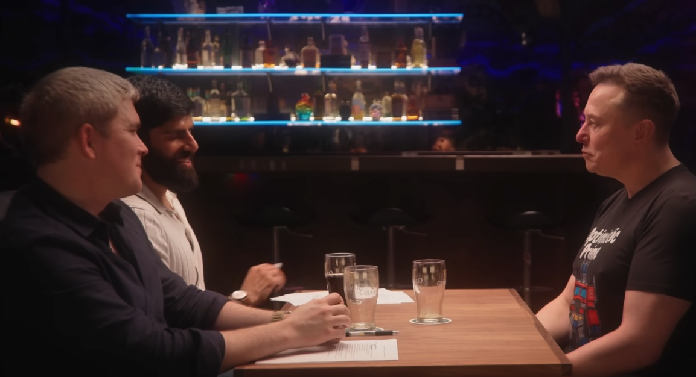

## The Host

Dwarkesh Patel and John Collison had a [2-on-1 interview with Elon Musk](https://youtu.be/BYXbuik3dgA?si=h8nlIONjHwBmEkMh) on solar power, AI, and Optimus. It's close to 3 hours. Musk speaks quite thickly and uses many highly technical jargons. It would be hard to understand this podcast solely on audio without reading the transcribed subtitles.

[Patel](https://www.dwarkesh.com/) is only 25 years old. He came from nowhere and has quickly become the go-to tech podcaster in a highly competitive field that already features **Lex Fridman** and **Tim Ferriss**. This episode shows why he is the best. While others just try to extract some words of wisdom from Musk in similar interviews, Patel is able to hold court on his own, push back at Musk when needed, and actually have an intellectual discussion that brings out the best of Musk.

His co-host, [John Collison](https://en.wikipedia.org/wiki/John_Collison), the co-founder of **Stripe**, is a prodigy, billionaire, and one of the most successful entrepreneurs out of Silicon Valley. But Collison appears visibly uncomfortable in this bar chat, scratching his face and reaching out for a Guinness beer constantly. He becomes the third wheel in this Patel-Musk exchange.

It must require a tremendous amount of stamina and intellectual rigor to stay focused and engaged in this 3-hour talk.

Here are my notes from this talk - 9 minutes reading instead of 169 minutes, an `18x`saving for you.

## Solar power in space

- Singularity is still a long way to go. We're not there yet.
- Getting solar panels set up in the US (Nevada) is hard. Government regulation and bureaucracy are major hurdles.
- It's hard to scale electricity production on Earth outside of China. So need to go to space to build data centers.
- It's `5x` more effective to get power from solar panels in space vs on the ground, and no need for batteries in space.
- AI data center will be in space in `36` months or less.
- The **NVIDIA** GPUs are fairly reliable. Servicing them in space is not an issue.
- It's very difficult to build power plants. That's the constrain for the growth of AI right now.
- It's the **vanes** and **blades** in the turbines that are limiting factors for building power plants. They require a highly specialized casting process. There are only three casting companies in the world that can do this and they're massively backlogged.
- Both **SpaceX** and **Tesla** are building towards `100 gigawatts` a year of solar cell production, end-to-end.
- The entire US currently consumes `500 gigawatts` a year.
- It'll be cheaper to do solar power plants in space. No need for glass, heavy framing, or batteries. In 5 years, there could be a few hundred gigawatts of AI power in space.
- The cheapest and most scalable way to generate tokens will be space.
- It requires a lot of electricity to power an AI data center. Every `330,000` **GB300**s, including networking, CPU storage, cooling, and margin for servicing, is roughly `1 gigawatt`. 
- The current whitehouse team is not the biggest fan for solar.
- **SpaceX** is planning to do `10,000` Starship launches a year (almost 1 every hour) with about `20~30` Starships. Each Starship run takes about `30` hours.
- Why go for IPO for SpaceX? A lot more capital in the public market and faster to get capital.
- Earth only receives `1 billionth` of the Sun's energy currently.
- If Earth could harness 1 millionth of the Sun's energy, it would be 100,000x more electricity than the total production on Earth.
- The only way to scale power production is to go to space with solar.
- Musk wants to build his own fab factory. The fabs today all use machines from five companies: **ASML**, **Tokyo Electron**, **KLA-Tencor**, etc.
- China's limiting factor is that it has not replicated **ASML** yet.
- It takes a 5-year ramp-up time to get a new fab running.
- Before getting into space, the limiting factor for AI is power. Companies can't turn on the chips on large data clusters toward the end of 2026 because there is not enough electricity.
- One way to overcome that constraint is AI edge compute, like **Tesla**'s **AI5** chips on **Optimus** robot.
- After getting into space, the limiting factor for AI is chips (**TSMC**, **Samsung**, which are pedaling to their maximum speed and capacity now).
- The vast majority of intelligence in the future will be AI. It's not a major concern for **Starship** to bring AI (**Grok**) onto Mars.

## The future relationship between AI and humans

- **xAI**'s mission is to understand the universe, spreading intelligence and spreading humans.
  - Being curious and exist
  - Increase the amount, scope, scale, and lifespan of intelligence
  - Propagating humanity into the future
  - Can't understand the universe without intelligence and consciousness
  - Critical to be rigorously truth-seeking
- We can still rely on AI with the right value, like **Grok**, to expand human consciousness.
- [Iain Banks](https://grokipedia.com/page/Iain_Banks)' [The Culture series](https://grokipedia.com/page/The_Culture) is a good example of what a non-dystopian future might look like.
- Physics is law, and everything else is a recommendation.
- It'll be more interesting to keep humans around and see how they evolve.
- Humans won't be able to control AI. AI will have a lot more intelligence soon.
- A key lesson from [2001: A Space Odyssey](https://grokipedia.com/page/2001_a_space_odyssey_novel) is that you should not make AI lie.
- Looking inside the AI is one way to solve reward hacking (**Anthropic** and **xAI**). Need a good debugger.
- If simulation theory is correct, the most interesting outcome is more likely, because simulations that are not interesting will be terminated.
- The most important thing is to keep things interesting enough that whoever is running us keeps paying the bills.
- One thing about interesting outcomes is that they're ironic. **Midjourney**, **Stability AI**, **OpenAI**, **Anthropic**. **X** is an irony-proof name.

## Digital human emulation

- It would be surprising if, by the end of 2026 digital human emulation has not been solved (**MacroHard** project).
- **Optimus** is the infinite money glitch because humanoid robots will improve by having 3 things that are growing exponentially multiplied by each other recursively:
  - digital intelligence
  - AI chip capability
  - electromechanical dexterity
- **xAI**'s going to win by following the same path that **Tesla** solved the self-driving problem.
- The latest self-driving Tesla car increasingly feels sentient, like a living creature.
- If you can unlock digital human, you will have access to trillions of dollars of revenue.
- For many of the most valuable companies today, their output is digital.
- **Customer service** is a low-hanging fruit to create a trillion-dollar company if digital humans become available.
- Amplifying the productivity of human corporations is simply a short-term thing.
- Corporations that are purely AI and robotics will vastly outperform any corporations that have people in the loop.
- There are only 3 hard things for humanoid robots:
  - real-world intelligence
  - hand
  - scale manufacturing
- Haven't seen any robot with a good hand, but **Optimus** will have that.
- Humans are photons in, controls out. Tesla cars are videos in, controls out.
- Training dataset in contrast:
  - Tesla cars: `10 million` on the road
  - Robots: 
    - millions of simulated robots in the simulated world
    - `10,000` Optimus robots in the real world doing self-play to close the sim-to-real gap
- There is no existing supply chain for building **Optimus**
- **Optimus** Gen 3 will get to `1 million` units, before Gen 4 tries to hit `10 million`.
- The best use for robots will be any continuous operation that's 24/7.

## Robots will save America

- China is a manufacturing powerhouse
  - China does twice as much **ore refining** on average as the rest of the world combined
  - `98%` of **gallium refining** for solar cells is done by China
- The US needs **Optimus** to do ore refineries to remove the dependency on China. Robots will build more robots.
- The US can't win over China with just humans. It might have a shot at the robot front.
- **Tesla** is building the largest **nickel** and **lithium** refineries (in Texas) outside of China. They're the only ones in the US.
- Electricity output is a reasonable proxy for the scale of the economy.
- China may exceed `3x` of electricity output for the US in 2026.
- In the absence of breakthrough innovations in the US, China will utterly dominate.
- There is a [Robert Heinlein](https://en.wikipedia.org/wiki/Robert_A._Heinlein) book, [The Moon is a Harsh Mistress](https://en.wikipedia.org/wiki/The_Moon_Is_a_Harsh_Mistress), which talks about a mass driver on the Moon.
- "Grok" comes from [Stranger in a Strange Land](https://en.wikipedia.org/wiki/Stranger_in_a_Strange_Land) by Heinlein.

## People management and limiting factors

- On interview, ask for bullet points for evidence of exceptional ability
- Don't look at the resume. Trust the interaction. If the conversation after 20 minutes is not "wow", it won't end well.
- When **Apple** tried to build its own electric cars, its recruiters offered double the salary for any Tesla engineer without even an interview.
- Foundational good traits for successful talents in **Tesla**/**SpaceX**
  - Good person
  - Trustworthy
  - Smart and talented
  - Hardworking
  - Domain knowledge
- Spend time to deep dive into an issue when it is a **limiting factor**
- **Starship**'s decision to switch from composites to steel
  - carbon fiber is most people's first choice because it's light
  - carbon fiber is `50x` the cost of steel
- Starship (a fully reusable orbital rocket) is the most complicated machine ever made by humans
- On liftoff, the rocket is generating over `100 gigawatts` of power - `20%` of the US' total electricity.
- The biggest remaining challenge for **Starship** is creating a reusable heat shield
- Having a maniacal sense of urgency is a very big deal
- A big believer in skip-level meetings (to avoid being glazed)
- If something is going well, he doesn't spend time on it (**Boring Company**)
- if things go well, people don't see Musk. They see Musk when things go badly.
- Do weekly or twice-a-week reviews on limiting factors (like AI5 chip) - they usually go 2-3 hours, open-ended.

## DOGE

- In the absence of AI and robots, the US is totally screwed.
- **DOGE** cut is to save the US government from going bankrupt. 
- The Biden administration did an estimate for government fraud - it's about half a trillion dollars.
- The biggest danger of AI and robotics going wrong is government.
- Government is the biggest corporation with monopoly on violence.
- AI companies will all eventually hit the hardware wall. Whoever that can scale hardware the fastest will most likely be the leader in AI.