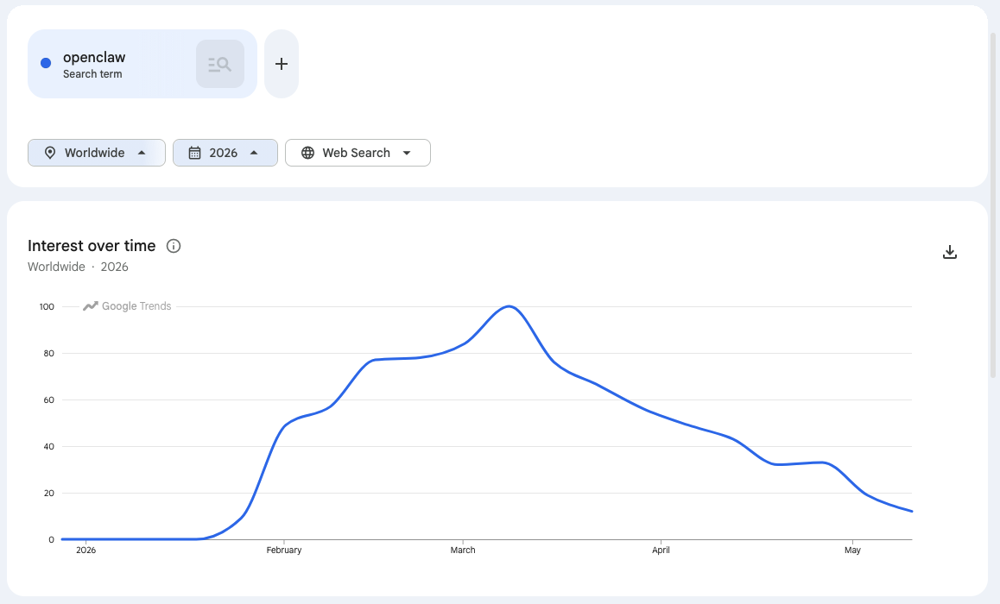
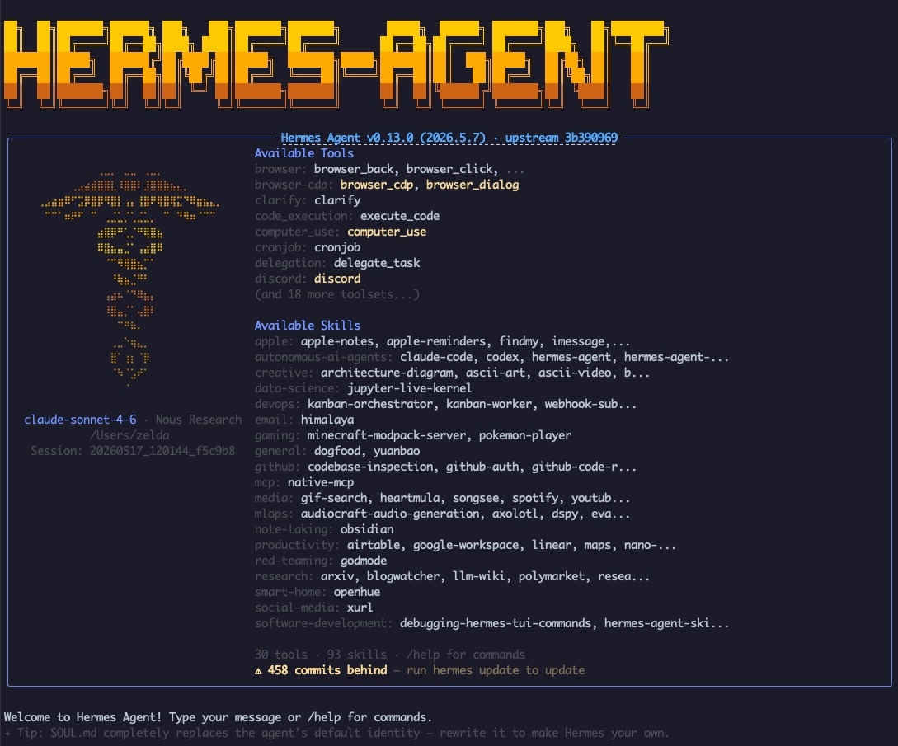
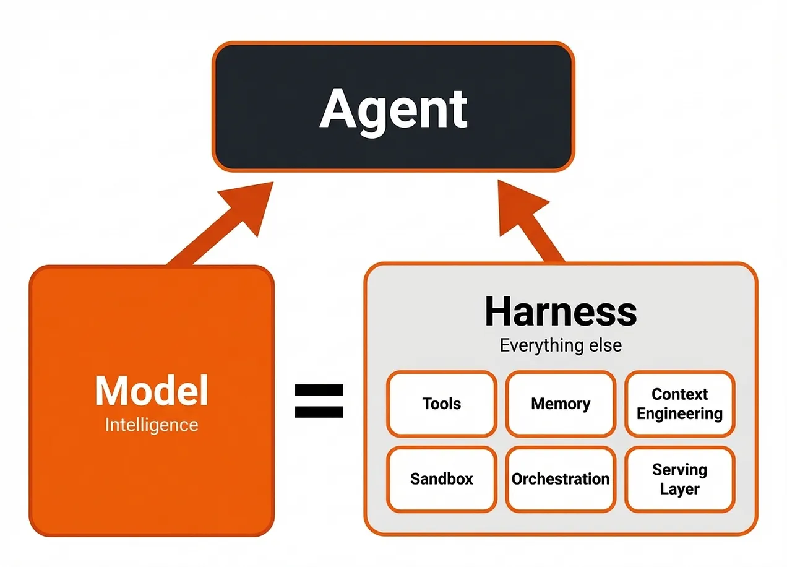

## The Rise of Agents

I dipped my toes in the muddy waters of the [OpenClaw craze](https://digitalsovereignty.herbertyang.xyz/p/beyond-the-hype-10-real-world-truths-about-living-with-openclaw-ai-assistant/) earlier this year. It was a lot of fun. The spectacular success of OpenClaw unlocked a whole new world and ushered us into a new age of AI agents, where things are now being built of the agents, by the agents, and for the agents.

Powered by AI models that kept pushing the boundary of what machine can do with much longer context window, an OpenClaw agent can do many things autonomously for their human masters. It elevates AI models from merely a cute chat bot or a patient software developer into a true personal assistant that can work for you 24/7 non-stop. 

It's a new form of computer. In the not so far away future, we might not need a MacBook anymore. All we need is an AI agent that talks to us and completes jobs for us on our favorite IM tools of the day, from Telegram, Signal, Whatsupp, to WeChat.

## The Problems with OpenClaw

While using OpenClaw for the first time was quite an eye-opening experience and even fueled a new industry of installing (and later uninstalling) OpenClaw agents, it quickly started crumbling under its own weight.

It's really difficult to use. Making configuration change was a pain. It could rarely complete a configuration change on its own. I almost always had to resort to **Claude Code** to perform a surgical change from outside or debug why the gateway stopped running. Something was always wrong or broken somewhere.

It's yet to find its true use-cases that prove its product-market fit, convincingly. Yes it can do decent coding jobs, but you might as well just use Claude Code or **Codex** if you're a serious developer. Yes it can run autonomously to perform scheduled tasks, but you could already do that with a cron job on Linux/Mac if you know your way around **Terminal** and **bash**.

Just like the massively overhyped **Manus** (so, you pay $200/month to do powerpoint ... is that it?) before it, OpenClaw left a strong impression for many non-tech users but much more to desire for the true techie crowd.

## First Impression with Hermes

I started experimenting with [Hermes](https://hermes-agent.nousresearch.com/) recently. It seems to be a refreshing upgrade over OpenClaw. Hermes, named after the ancient Greek god of messenger, is a self-improving AI agent built by Nous Research. 

It's much, much easier to switch to different LLMs with Hermes than with OpenClaw. Hermes seems to have listened to all the user complaints for OpenClaw, learned the lessons from its rival, and fixed (mostly) those issues from the get-go. I don't have to use Claude Code to perform those external open-chest surgeries anymore. With a plethora of large-language models (LLM) emerging every week and battling for the [OpenRouter League Table](https://openrouter.ai/rankings), it's imperative for an AI harness to allow users to switch LLMs seamlessly at the spur of the moment.  I can now do this easily with `hermes setup` directly with a few key strokes.

It's also much easier to integrate with **WeChat**. OpenClaw was a much bigger hit in China than in Silicon Valley. Hooking up with WeChat is mission-critical if a global protocol wants to reach out to the Chinese users. With Hermes, you can just scan a QR code and pair the agent with your WeChat account. OpenClaw probably paved the way though - its early success checked-mate all the big tech firms, created substantial fomo (fear-of-missing-out) for the Chinese cloud giants, and prompted them to allow agentic beings into their fiercely guarded digital fortress. 

Hermes' gateway also seems more stable than OpenClaw. Using **Python** and **SQLite** instead of OpenClaw's **Node** and **JSONL** files, it persists session state more aggressively in a more robust way. Its gateway, which allows for conversations over Telegram and WeChat, so far looks fairly resilient and does not crash often, unlike the very fragile gateway of OpenClaw.

## What NOT To Do with Hermes

I'm running my Hermes agents on a dedicated MacMini of 48 GB RAM and 1TB hard disk (M4 Pro, 2024), in its own non-admin macOS account. Whatever my agents do, they operate in an isolated environment with limited access to my main driver - an M1 2021 MacBook Pro. 

In my second try of AI agent, an important decision is what NOT to do with it.

This used to create a great deal of confusion. If the OpenClaw agent could do something well, was that simply because its LLM was the mighty Opus 4.7, or because its harness was designed in a smarter way than others in terms of milking the same mediocre LLM in a more creative way? Keep in mind that:

> Agent = LLM + Harness

I use Claude Code (with a Pro account) exclusively for all my coding work. Hermes could do coding too, if I designate Opus 4.7 as its primary model, but I don't think it would do a better job than my using Claude Code straight-up.

This means, if I need to hand-roll a one-off Python script to clean up my legacy markdown files from **Pelican** blog site, or migrate contents from two **Github** repos to another new **Gitea** repo, I still go with Claude Code and would not waste time in Hermes. That's not what Hermes is best at.

That said, not everyone can use a Terminal-based Claude Code comfortably. For a non-tech person, it's quite possible that he can experience the joy of vibe coding through his Hermes agent instead of Claude Code. Well, good for you then, mate.

## Agent or Subagent?

The second question that confused many people in the early days of OpenClaw: agent or subagent? This decision has a profound impact to the file structure of OpenClaw/Hermes folder. 

Subagent is spawned by the agent, in an ephemeral fashion. It's created temporarily to complete a task. When that task is done, this nameless subagent is gone. Agents shall persist with their own personality, soul, and memory, but subagents do not.

A few months ago, everybody was dizzy on this subject. OpenClaw was dizzy, allowing users to create both multiple agents and multiple subagents under an agent. Claude Code was dizzy, trying to investigate in futile whether the machine talking to me was an agent or a subagent (often disguised by an agent). I was dizzy, going down that endless rabbit hole and thought subagent was a thing.

The answer in May 2026 is clear: 

> It's the agent, stupid

What we want out of Hermes/OpenClaw is either a single agent or multiple agents. They each have their own folder, SOUL.md, designated models, and memory.

## Set Up Multiple Agents

After going through a soul-searching journey to sort out what not to do with AI agent and what actually is an agent, we can now set up the agents for what they're really good at.

I have set up 3 Hermes agents: `Zelda` is the personal assistant to myself and my family; `Muradin` is my coding assistant that executes simple, well-defined, routine grunt work; `Varian` is my scout and intelligence officer that roams the web to fetch valuable information for me with filtering and curation.

| Agent | Role | Primary Model | Fallback Model |
| --- | --- | --- | --- |
| Zelda | squire | Anthropic/Sonnet-4.6 | Qwen3.6-35B-A3B |
| Muradin | engineer | DeepSeek/DeepSeek-V4 | Qwen3.6-35B-A3B |
| Varian | scout | Qwen3.6-35B-A3B | N.A. |

I used to have 6 agents in OpenClaw. That was an overkill. I'll be very happy if these 3 amigos can work in tandem and accomplish cool tasks collaboratively.

### Zelda the Squire

Zelda needs to be **smart** and **reliable**. So I endow Zelda with the most powerful AI model of the day - `Sonnet 4.6` from Anthropic (with an API key as Anthropic has banned third party from using its subscription accounts). If I use the same model through **OpenRouter** (an aggregator for all the AI models), which charges 10-20% higher fee, I can pay for the token usage in cryptocurrencies instead of fiat and have a unified bill. I use OpenRouter when I need to use models for anonymous projects (to maintain anonymity). Otherwise I'll go with the original model provider.

I'm not using Zelda much, yet. For one-off queries, it's easy enough to get answers from general Google search, claude.ai, Gemini, or several AI chat bots from China. I don't necessarily want Zelda to know EVERYTHING I do. Maybe in a not so distant future I'll have to, but that's not a top priority for me right now.

I can see Zelda help me with two very specific use cases:

1. Be the personal assistant not only for me, but also for my wife and son in a group chat. They can post questions and get answers, in a moderated fashion. I can't possibly expect them to use Telegram or Signal, so the only viable IM tool is **WeCom** (the enterprise version of WeChat). WeChat does not allow agent bots to send messages in a group but WeCom does. 

2. Give me proactive suggestions for self-improvement based on my **Obsidian** vault (named "`Mentat`"). I have been writing daily journals on and off in Markdown for close to 10 years. When Mentat's knowledge base is rich enough, I'll probably take the leap and open it to Zelda so that it can build a true second brain for me. **Roam Research** and Obsidian saw the future of augmented personal wikipedia but no one could foresee AI's capability evolve so fast to actually bring this vision into reality, by 2026.

### Muradin the Engineer

While Claude Code is my CTO, Muradin is my junior coding assistant. I use Muradin for two things that are neither mission-critical or urgent but nice-to-have. 

1. Reviewing the codes of my 20+ project repos. Finding bugs, suggesting fixes, and submitting PR (Pull Request) for me to review and merge. If Muradin is not smart enough to complete these tasks, that's not a big deal but I'd like the idea of an agent working for me day and night making small and incremental improvements to my products and giving me pleasant surprises every now and then.

2. Roaming Github and finding interesting open-source projects for me to contribute PRs. In the last 18 months I've transformed myself from a finance/BD executive to a Staff Frontend Engineer. I can build products and ship them. I want to be part of the open source movement and earn my street credibility there by helping others and learning from them (the CEO of the most powerful startup incubator in Silicon Valley, **Y Combinator**, is doing the same. In 2026, if you don't code, you know nothing about AI). I will still be the one to submit PR, but Muradin can be the one to actually create a branch, write the code, and draft the commit message.

The best LLM for coding as of May 2026 is still Anthropic's Opus 4.7. I'm already spending hours on Opus everyday and don't need to throw more Claude tokens at Muradin. Muradin is a hard worker that's competent enough to make me better but does NOT need to so intelligent that its every PR cries for my utmost attention.

By the end of the day, my own bandwidth is the bottleneck. I can maybe spend 10% of my bandwidth with Muradin, tops.

Muradin's model needs to be just good enough and economical, hence the choice of `DeepSeek V4`, which is cheaper than Opus 4.7 by 20-30x.

### Varian the Scout

Varian's mandate is to filter interesting information, discover new users, and relay system alert messages from web services and apps. I want it to work 24/7, with the cheapest token possible.

Varian does 

One of my Hermes agents
My personal documents and files are version-controlled and synced to git repos in a virtual machine (Ubuntu 24.04.03) deployed on my home NAS (Network Access Server) Synology 918+ (4-bay model). Across my per 

