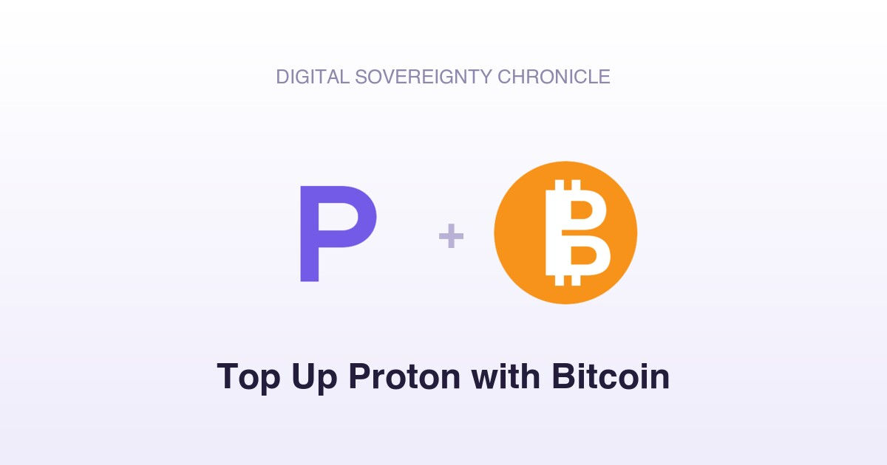
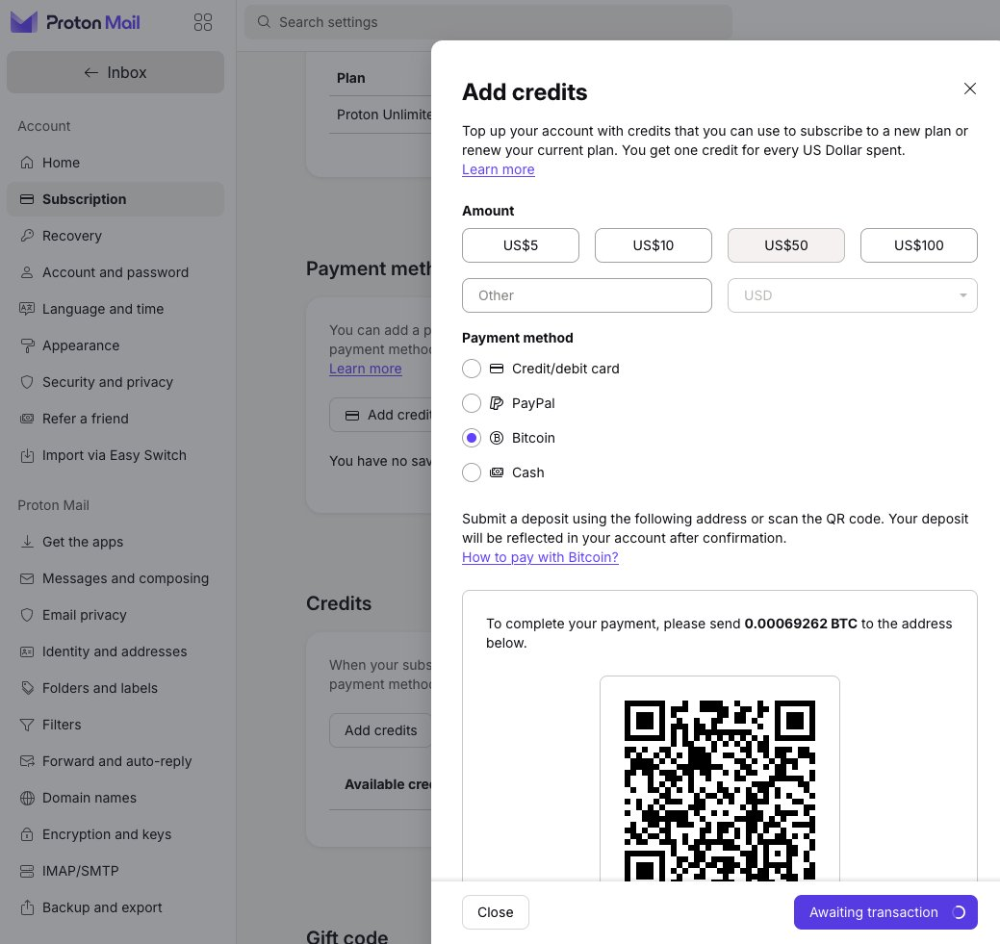

I switched to Switzerland-based [Proton](https://proton.me/) about 10 years ago from **Gmail** as part of the effort to de-google myself. Even [Jeff Dean left Google](https://www.cnbc.com/2026/08/05/google-chief-scientist-jeff-dean-leaving-company-after-27-years.html) after 27 years. If you still rely on Google for everything, you are exposing yourself too much to the system. You're just running naked.

Among Proton's many great features, one of them is that it accepts crypto payment in **bitcoin** . 

For an user familiar with the [Internet Computer](https://internetcomputer.org/) (or [ICP](https://coinmarketcap.com/currencies/internet-computer/), one of the major blockchains in the world), this is how you can take advantage of this to use `$ICP` to pay for Proton services. 

1/ In your [Oisy](https://oisy.com/) wallet (the best ICP wallet, built by the [DFINITY](https://dfinity.org) team that created ICP), convert `$ICP` into `$ckBTC` . As both are using ICP's [ICRC](https://docs.internetcomputer.org/references/digital-asset-standards/) standard, the conversion is instant and has no gas fee. 

2/ In Oisy's BTC asset, which includes both the native BTC and ckBTC (in an[account abstraction](https://ethereum.org/roadmap/account-abstraction/) fashion), choose `ckBTC`, and then convert `$ckBTC` into `$BTC` .  This step will require the standard block confirmation on the BTC mainnet (`~10` minutes per block and Oisy requires `6` blocks for this conversion).

3/ In the Proton account, All Settings => Credits => Add Credits, pick the dollar amount. Proton will provide the needed BTC amount and a BTC address (this address is regenerated every time, not a static one). 

4/ In Oisy, send over this amount of BTC to the Proton address. Proton will show something like, "your credit is received ...". This "Add credits" pop-up window will disappear. 

When Bitcoin mainnet's confirmation is finished (30-60 minutes), the "Credits" section will display the updated balance from the BTC top-up, and Proton will automatically deduct the monthly fee from this balance on the due date.

This is almost perfect, except that Proton does not support a yearly subscription with BTC yet - so you can only pay BTC as you go month to month (but it's automatic deduction, so it's good enough), not in an annual plan fashion, which can save 20-30%.

Of course, you don't have to use ICP to initiate this transaction. You can convert any cryptocurrency like Ethereum or Solana or USDT/USDC into Bitcoin and go through this loop.

Why go through the trouble of using BTC/ICP but not a credit card or PayPal? 

No KYC (know-your-customer), love. Every time you provide your credit card to make a payment, the system knows who you are. 

Total anonymity is your true protection.