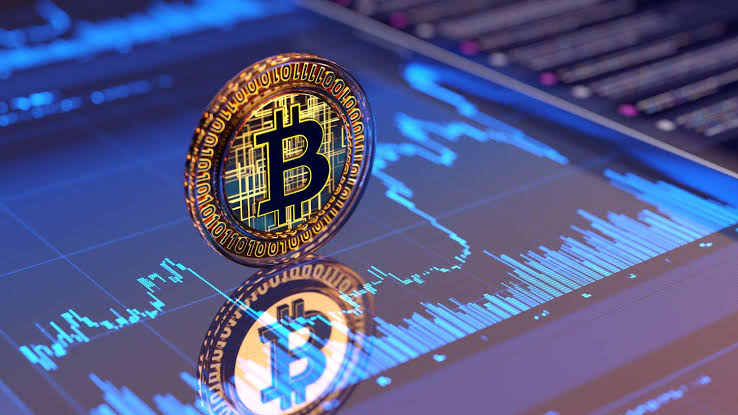

## Introduction

From time to time, when the Bitcoin price swings back, non-crypto friends start asking the question:

> Where can I buy Bitcoin?

The most straightforward way is to buy Bitcoin from a **centralized crypto exchange** (“CEX") that has a government-issued license to sell Bitcoin to retail users in the region where you’re from. Once you acquire Bitcoin from this CEX, you can then transfer it into a cold wallet where you own full custody.

Do not buy Bitcoin (or other cryptocurrencies) from an OTC or peer-to-peer network. It has too much risk and often operates in a legally gray area. 

Do not buy Bitcoin from an ETF (Exchange-Traded Fund). Owning a share of the ETF does NOT give you ownership of the underlying Bitcoin. You are investing in the ups and downs of Bitcoin, but you do not own that asset. 

Do not “buy” Bitcoin from a friend’s VC fund that “invests” in Bitcoin. If you want to help out a friend, that’s fine, but that does not place Bitcoin into a wallet that you can control. 

Do not try to acquire Bitcoin by doing PoW (Proof-of-Work) of other less expensive cryptocurrencies (with your computer). More than ten years ago, that was the way to get Bitcoin, but not anymore. Technically speaking, you could do enough PoW of some other cryptocurrencies and then convert those tokens into Bitcoin on a decentralized crypto exchange (“DEX") like [Uniswap](https://app.uniswap.org/). However, in 2026, this route is becoming extremely difficult as pure-play PoW tokens are fading. Also, if you have that much compute power, you should put it all into running a local front-tier LLM rather than mining for PoW cryptocurrencies. 

## Which CEX?

This guide is for friends from traditional domains who are not familiar with crypto. Crypto is a very dynamic industry, and its regulation is evolving fast in many countries and changing month to month. This is **NOT** financial advice, and you should always do your own research to check the latest government policy. The brief below is based on what governments published as of August 2026. 

If you are a citizen of the following country:

### China

For passport holders of Mainland China, 

> It is illegal to buy cryptocurrencies under Chinese law.

On 6 February 2026, eight PRC regulators — PBOC, NDRC, MIIT, NFRA, CSRC, SAFE and others — issued the **Notice No. 42** on "*Further Preventing and Dealing with Virtual Currency and Other Related Risks*". It extends the 2021 ban: offshore entities and individuals are now prohibited from providing virtual-currency services to persons in mainland China in any form. Previously, the restriction applied to onshore employees and affiliates; now it applies to the offshore provider itself.

So if you’re a Chinese passport holder, there is no legal way to acquire Bitcoin.

### Hong Kong

There are 13 licensed platforms as of August 25, 2026, but there are only two that are exchange-traded companies with audited public filings and disclosed volumes - [Hashkey Exchange](https://www.hashkey.com) and [OSL Exchange](https://www.osl.com). The rest are either not mature enough, or targeting institutions and professionals only, or only offering limited access.

[ZA Bank](https://bank.za.group) is the settlement bank for both Hashkey and OSL. 

The irony of Hong Kong is that it built a licensed register for the global players, but all the global giants eventually all abandoned their efforts to land in Hong Kong, except for the two local ones.

### Singapore

Roughly 36-37 firms held Major Payment Institution licenses as of January 2026, but that list mixes exchanges, custodians, payment apps, brokers, and stablecoin issuers. 

[Coinbase Singapore](https://www.coinbase.com/en-sg) is the most established entity, followed by [Crypto.com](https://crypto.com) and [OKX](https://www.okx.com). All are [MAS](https://www.mas.gov.sg)-licensed large global crypto exchanges. 

### Taiwan

It’s murky water.  [BitoPro](https://www.bitopro.com) has the lion’s share of the market share (>90%). 

### USA

For US residents, the big three would be [Coinbase](https://www.coinbase.com), [Gemini](https://www.gemini.com), and [Kraken](https://www.kraken.com/).

USA has the most dynamic scene in crypto. Besides CEXs, traditional payment companies and banks also started offering Bitcoin purchases directly. You can now buy Bitcoin directly in [PayPal](https://www.paypal.com), which allows token transfer into a cold wallet. Many large banks, JPMorgan Chase, Morgan Stanley, Wells Fargo, and Citi are following suit.

**ACH** and **wire** are still the best way to buy Bitcoin. Credit cards are often blocked.

### Canada

**Coinbase** and **Kraken** are the leading players, with local exchange Shakepay as an alternative option.

## Where are the big-name CEXs?

A counterintuitive surprise is that many leading crypto exchanges do not seem to have the license to sell crypto to retail customers in many Asian regions, such as **Binance**, **Bybit**, **Bitget**, **HTX**, **KuCoin**, and **Gate**. They get users from many countries where jurisdictions are still being formulated and have yet to form a gate. 

Also, the biggest challenge for a crypto exchange is the on-ramp - getting fiat money into crypto. Some crypto exchanges choose to apply for that license with their own local entities, like OKX SG and Coinbase SG in Singapore. 

Some crypto exchanges, like Gate, rent access through licensed third-party processors and through P2P. Such a reliance does not lock them out of the market, but makes their fiat access borrowed and revocable.