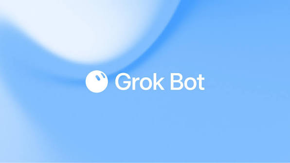

Recent experiments with **Hermes** and the growing momentum of **Grok Bots** led me to think harder about what really makes various AI agents different. What kind of use-case scenarios are most suitable for each?

Especially, where does Grok Bot fall into? It’s similar to existing AI agents in many ways, but also quite distinctive. 

I’d chart them in a table like this, for better understanding and contrast.

| Dimension \ Product Type  | coding agent (cloud LLM) | coding agent (local LLM) | chat agent | self-hosted agent| persistent cloud agent |
| :---- | :---- | :---- | :---- | :---- | :---- |
| Example| **Claude Code**  + API| **Opencode** + local LLM| **claude.ai**, **Grok**, **chatGPT**, **Gemini** | **OpenClaw**, **Hermes**| **Grok Bot**|
| Task Type| coding| coding| general reasoning| general reasoning + coding | general reasoning + coding |
| Source of Prompt| app | app | web| phone | app + phone|
| Source of Intelligence| cloud-hosted LLM| local-deployed LLM| cloud-hosted LLM| cloud/local LLM| cloud-hosted LLM|
| Role| generalist| generalist| generalist| generalist/specialist| specialist| 
| Where does its session state persist | local| local| cloud| local| cloud|
| Runtime Included?| yes| yes| no| yes| yes|
| Source of Runtime| local| local| N.A.| local| cloud|

A key measure of success for agentic autonomy is an agent's ability to persist session states - the prompt, the scripts to do various tasks, and the status of those tasks. AI needs to remember those states in order to iterate and loop until the mission is complete.

On a local device, those session states can persist in `tmux` windows with a `launchd` service (for **macOS**) that can survive a system reboot. 

A parallel path is to persist those states on the cloud, so that AI agents can keep working for us, regardless of whether we’re away from the keyboard or not. AI can just keep going at the task continuously, non-stop.

Grok Bot persists session states on the cloud. Chat products had cloud memory; few paired it with a real remote runtime.

A runtime environment is needed for the machine to actually deliver the goods to humans, not just “here’s how you can do it and you can now copy/paste the code to give it a try”. 

Grok Bot has a runtime in the cloud, so it can execute programs in a remote cloud-hosted runtime, just like how Claude Code can execute the same programs on the local machine. 

So Grok Bot seems to combine the best of both Claude Code (coding with tasks persisted locally) and claude.ai (reasoning with queries persisted in the cloud), and provides what Hermes wants to do out of the box - multiple agents specialized in dedicated roles to deliver deterministic results (enabled by its runtime) and reason with users in perpetual loops (session states persisted in the cloud). 

It doesn’t quite fit into any existing AI product category. It’s a new emerging class of its own: 

> Persistent cloud agent - an AI with its own computer in the cloud

This gives me an eerily familiar vibe - isn’t this just a canister in the universe of the [Internet Computer Protocol](https://internetcomputer.org/) (“ICP”)? **ICP** is one of the major L1 blockchains developed by the Switzerland-based [DFINITY Foundation](https://dfinity.org/).

Similar to Grok Bot, canisters are persistent programs that live in the cloud - except in a decentralized network infrastructure of compute and storage that happens to be a perpetually growing blockchain with consensus and a tradable token ($ICP). 

DFINITY launched [Caffeine](https://caffeine.ai) in 2025 and marketed it as a “self-writing Internet” technology. The acronym SWI didn’t quite catch on like wildfire. It’s positioned too closely to **Cursor**, **Claude Code**, and **Lovable**.  It was competing in a very crowded lane.

More importantly, “[building software](https://caffeine.ai/about)”, as Caffeine/Lovable still list as their mission, is no longer the meaningful goal for users in 2026. Software is just a means to an end. That end is the answer to a question or a solution to a problem. The shape or form of the method that an AI agent uses to deliver that answer/solution, which is traditionally called software, is now irrelevant to today’s users.

Grok Bot seems to get that. It can certainly write code and execute it, but it doesn’t try to dazzle me with 300 lines of Rust code. It just gives me the result straight up. I want some prospective users. It scouts the Internet and builds a CRM-style database on [Airtable](https://www.airtable.com/) for me. This is what I want. 

In the end, a human user wants information, content, and money. This should be the goal for any persistent agent - whether it is on the cloud or running on local machines. The choice of cloud vs local is more a question of privacy for the user. Software is becoming one of the transient noises in the process, under the hood, and gradually nobody would even notice that.

This feels like the watershed moment where the old regime of building software is dying, and a new breed of persistent agents is rising that peels off all the intermediary layers and serves up directly what humans want. 

2026 is becoming really interesting.