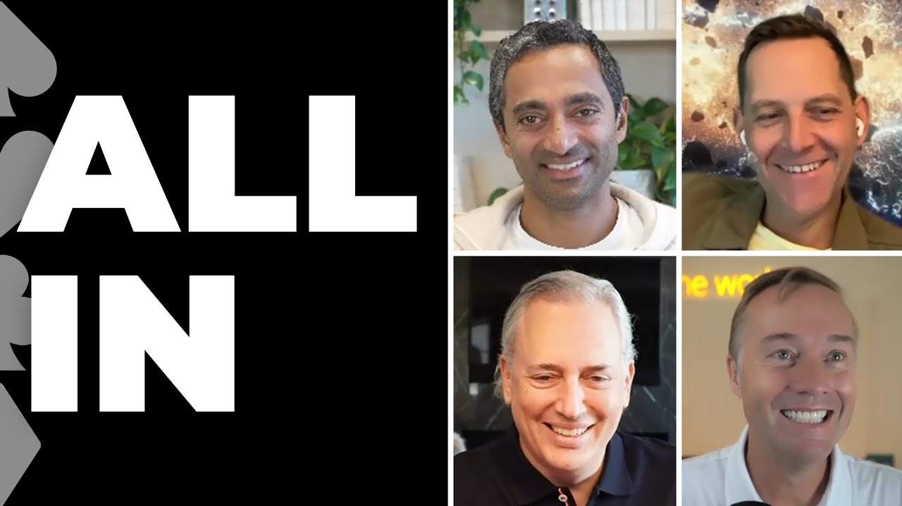

As of September 2026, the [All-In](https://allin.com/) podcast is the only one I listen to regularly now. 

It’s slightly uncomfortable for me to admit that, as I used to consume a lot of podcasts, from the early days of [The Tim Ferriss Show](https://tim.blog/podcast/), then [Lex Fridman](https://lexfridman.com/podcast/), [Acquired](https://www.acquired.fm/), and many others, as I shared in [10 Podcasts on Tech in 2025](https://digitalsovereignty.herbertyang.xyz/categories/curation-tips/). 

The problem with many podcasts is that they are too long and too heavy. **Fridman**’s podcast episodes often run up to 3~5 hours. **Ferriss**’ episodes are often multi-part and multi-hour. **Acquired** always delivers superb quality, like that amazing episode on [Lockheed Martin](https://www.acquired.fm/episodes/lockheed-martin), but it takes a ritual to consume those stories. It requires a lot of effort, dedication, and time.

I don’t have that much time now. When I used to work for a big company, every minute I could squeeze in to enrich myself (or play another mission in **Black Myth: Wukong**) felt like a gain. When I [work for myself](https://digitalsovereignty.herbertyang.xyz/p/from-one-project-to-ten/) and have complete control of my own calendar, every minute counts and needs to bring back a return somewhere. 

The All-In podcast is a weekly show with a 60-90 minute runtime per episode. It blends technology, crypto, politics, and economics - the exact fix I need if I could splurge that much time on only one podcast every week. I don’t want to overindex my news consumption on politics and economics and certainly need to cap the ceiling for tech and crypto. All-In’s dosage is just right. 

It’s co-hosted by four Silicon Valley billionaires (Jason may not get there yet, but let’s just do a round-up), **Jason Calacanis**, **Chamath Palihapitiya**, **David Sachs**, and **David Friedberg**. Initially, I didn’t like this format. I was like, who are these people, who do they think they are, and why do they just rudely talk over each other and trade those banters as if we care. If I don’t watch the video on YouTube but only listen to the audio show on Apple Podcasts, it would be difficult to figure out who is who. It takes a bit of getting used to. 

But after I got used to this format, it’s like watching the water cooler conversation in Silicon Valley. They cover all the interesting topics a tech bro cares about. It’s pretty cool. They don’t always agree with each other, especially between David Sachs and Jason Calacanis, but those debates and arguments spice up the show, bringing a strong sense of authenticity and raw energy, if not bromance. 

Chamath is the consummate smooth talker. He’s eloquent. You feel that whatever this man says must be right (I’m fully aware of his reputation among retail investors and his track record in the SPAC business). He brings an immense presence on the microphone. It’s an admirable craft. Occasionally he’s too full of himself and would coldly and assuredly proclaim that he doesn’t know who **Paul Thomas Anderson** is but enjoys hanging out with **Michael Bay**.

David Sachs is the straight-shooter, no-bullshit guy. He was too harsh on Jimmy Kimmel, but he’s got too much sway on the AI/crypto policy of the White House. It helps to stay up-to-date with him.

I don’t subscribe to everything they say, but their views are an effective proxy for what a lot of American investors, founders, and leaders are thinking, for better or worse. There is a lot of value in that.

They are certainly naive about China and drink the whole “Re-industrialize America" Kool-Aid. Given their proximity to the White House, they have to play their card right, even if they secretly admire what China is doing (who is not?).

If they know more about China, that would be actually scary. I like their ignorance on that, so far.

Besides the All-in podcast, I also occasionally check out other shows if there are good episodes:

- [Dwarkesh Podcast](https://www.dwarkesh.com/podcast). Coming from nowhere (well, he was a roommate with **Dylan Pate**l of **SemiAnalysis**), Dwarkesh’s show has become the go-to tech podcast in 2026, beating Fridman, Ferriss, and everybody else (**John Collison**’s **Cheeky Pint**). He regularly books the biggest names in tech. The lucky bastard is only 26.
- [Lex Fridman](https://lexfridman.com/podcast/). He came back from a global trek with a 5-hour bang with **DHH**, the creator of [Omarchy](https://omarchy.org/), the AI-native Linux OS. He still got it and refused to cede the crown to Dwarkesh.
- [Tech Brew Ride Home](https://www.techbrew.com/welcome). The daily fix in 20 minutes. I like **Brian McCullough**’s energy.
- [Acquired](https://www.acquired.fm/). They still do high-quality research and mesmerizing corporate stories, but I’m not very interested in those companies anymore.
- [Joe Rogan Experience](https://www.joerogan.com/). If I need some diversity chill outside of tech, I may stop by here. Rogan doesn’t grill his guests and serves up all the softballs. 
- [Y Combinator Startup Podcast](https://www.ycombinator.com/blog/tag/podcast). They are all-in on AI and vibe coding. It’s good to check what’s hot in the valley, though **Garry Tan** is a bit hot-headed.
- [The a16z show](https://a16z.com/podcasts/a16z-show/). Another choice on AI and startups. They book good guests. **Andreessen** is anti-China, but his view is followed by too many in America, like David Sachs. Can’t ignore him yet.
- [Web3 101](https://web3101.fireside.fm/). It’s the best Chinese podcast on crypto and Web3. **Liu Feng**, partner of BODL Ventures and former Editor-in-Chief for **ChainNews**, always brings tremendous insight and knows how to ask high-quality questions (most other Chinese podcast hosts do a poor job of asking questions).
- [Smartless](https://www.smartless.com/). Three co-hosts, including **Jason Bateman**, trade banter and Hollywood insider gossip. It’s the All-in for the entertainment business.
- [When Shift Happens](https://www.kevinfollonier.com/when-shift-happens-crypto-web3-podcast). The host **Kevin Follonier** tries too hard to be cute and slightly cringe to listen to (just like Ferriss), but his guests are big names in crypto and bring more insight than Bankless.
- [Lenny’s Podcast](https://www.lennysnewsletter.com/podcast). The go-to podcast for product managers.
- [The Sunday Blender](https://weekly.sundayblender.com/). The best weekly news for curious kids. There is no show like this anywhere else. If you don’t want your kids to become another TikTok-addicted zombie, subscribe to the show and actually learn something about this big world. No politics. No diversity ideology. No violence.

After 15 years of podcast listening, I think it’s probably time to create my own podcast on YouTube. It seems to have become the primary and only information discovery platform for many. Stay tuned.